<div align="center">

<h1>🎯 phishing-simulation</h1>

<h3>AWS で作る、標的型攻撃メールの訓練用ページ</h3>

<p>📦 <strong>Amazon S3</strong> ・ 🌐 <strong>Amazon CloudFront</strong> ・ ⚡ <strong>CloudFront Functions</strong> ・ 📊 <strong>Amazon CloudWatch Logs</strong> ・ 📄 <strong>HTML / CSV</strong></p>

<p>AWS に詳しくない方でも作業できるように、<br>
押すボタンや入力内容を順番に説明します。</p>

</div>

---

> [!CAUTION]
> ⚠️ 必ず会社や組織の許可を得てから実施してください。パスワードや個人情報を入力させるページは作らないでください。

<p align="center">
  <a href="#overview">🗺️ しくみ</a> ・
  <a href="#words">📖 用語集</a> ・
  <a href="#steps">🚀 Web ページを公開</a> ・
  <a href="#logging">📊 アクセスを確認</a> ・
  <a href="#check">✅ 最後の確認</a> ・
  <a href="#help">🆘 困ったとき</a>
</p>

<a id="overview"></a>

## 🗺️ 作るしくみ

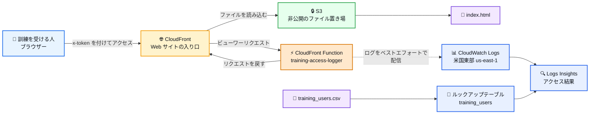
```mermaid
flowchart LR
    A["👤 訓練を受ける人<br/>ブラウザー"]
    B["🌐 CloudFront<br/>Web サイトの入り口"]
    C["🔒 S3<br/>非公開のファイル置き場"]
    D["📄 index.html"]
    E["⚡ CloudFront Function<br/>training-access-logger"]
    F["📊 CloudWatch Logs<br/>米国東部 us-east-1"]
    G["📄 training_users.csv"]
    H["🔎 ルックアップテーブル<br/>training_users"]
    I["🔍 Logs Insights<br/>アクセス結果"]

    A -->|x-token を付けてアクセス| B
    B -->|ビューワーリクエスト| E
    E -->|リクエストを戻す| B
    B -->|ファイルを読み込む| C
    C --> D
    E -.->|ログをベストエフォートで配信| F
    G --> H
    F --> I
    H --> I

    classDef person fill:#e8f4ff,stroke:#1f6feb,color:#0d1117,stroke-width:2px;
    classDef cloud fill:#fff3cd,stroke:#f59e0b,color:#0d1117,stroke-width:2px;
    classDef storage fill:#e6ffed,stroke:#2da44e,color:#0d1117,stroke-width:2px;
    classDef file fill:#f3e8ff,stroke:#8250df,color:#0d1117,stroke-width:2px;
    classDef compute fill:#ffe8cc,stroke:#d97706,color:#0d1117,stroke-width:2px;
    classDef logs fill:#e8f0ff,stroke:#2563eb,color:#0d1117,stroke-width:2px;

    class A person;
    class B cloud;
    class C storage;
    class D,G file;
    class E compute;
    class F,H,I logs;
```

- `S3` に Web ページのファイルを保存します。
- `CloudFront` を Web サイトの入り口にし、S3 は直接公開しません。
- `CloudFront Function` が URL の `x-token` を読み取り、CloudWatch Logs へログを出力します。
- `training_users.csv` を CloudWatch のルックアップテーブルに登録します。
- Logs Insights でログとルックアップテーブルを突合し、アクセス日時、トークン、氏名を表示します。
- この構成では Lambda、DynamoDB、Web ページから呼び出す API を使用しません。

> [!WARNING]
> 📊 CloudFront Functions のログは、CloudWatch Logs へ**ベストエフォート**で配信されます。反映まで数分かかる場合や、まれにログが配信されない場合があります。全アクセスの完全な証跡や、監査・課金の根拠には使用しないでください。

### 📍 作業の流れ

| 1️⃣ 保存場所 | 2️⃣ HTML | 3️⃣ Web 公開 | 4️⃣ トップページ | 5️⃣ 表示確認 |
| :---: | :---: | :---: | :---: | :---: |
| S3 | `index.html` | CloudFront | Default root object | HTTPS で確認 |

| 6️⃣ ログ関数 | 7️⃣ 関数の関連付け | 8️⃣ ログ確認 | 9️⃣ 氏名テーブル | 🔟 集計 |
| :---: | :---: | :---: | :---: | :---: |
| CloudFront Function | ビューワーリクエスト | CloudWatch Logs | CSV を登録 | Logs Insights |

---

<a id="words"></a>

## 📖 よく出てくる言葉

| 言葉 | かんたんな意味 |
| --- | --- |
| AWS マネジメントコンソール | ブラウザーから AWS のサービスを設定する管理画面 |
| リージョン | AWS の設備がある地域。S3 は利用者が選んだリージョン、CloudFront Function のログは `us-east-1` を使う |
| S3 | ファイルを保存する場所 |
| バケット | S3 の中に作る、ファイル入れ |
| CloudFront | S3 のファイルを Web サイトとして表示するサービス |
| ディストリビューション | CloudFront で作る Web サイトの設定 |
| オリジン | CloudFront がファイルを取りに行く場所。この手順では S3 |
| ビヘイビア | URL のパスごとに、キャッシュや関数の実行方法を決める設定 |
| CloudFront Functions | CloudFront へのリクエストやレスポンスを短い JavaScript で処理する機能 |
| ビューワーリクエスト | ブラウザーから CloudFront へリクエストが届いたときに発生するイベント |
| クエリパラメーター | URL の `?` より後ろに付ける値。この手順では `x-token` を使う |
| CloudWatch Logs | AWS サービスが出力するログを保存・確認するサービス |
| ロググループ | 同じ用途のログをまとめる入れ物 |
| ログストリーム | ロググループ内でログレコードを分けて保存する単位 |
| Logs Insights | CloudWatch Logs のログをクエリで検索・集計する機能 |
| ルックアップテーブル | ログの値を CSV の情報と突合するためのテーブル |
| デプロイ / 公開 | 設定やコードを実際に使える状態へ反映すること |
| キャッシュ削除 | CloudFront に残っている古いファイルを無効にする操作 |

---

## ✅ 作業を始める前に

次の5点を確認してください。

- AWS マネジメントコンソールにサインインできる
- S3、CloudFront、CloudFront Functions、CloudWatch Logs を設定できる権限がある
- 訓練の対象者、実施日、問い合わせ先が決まっている
- S3 バケットを作成するリージョンを1つ決めている
- このプロジェクトの [`index.html`](./index.html) と [`training_users.csv`](./training_users.csv) を使用できる

> [!NOTE]
> 💡 AWS の画面は変更されることがあります。ボタンの場所が少し違っても、同じ名前の項目を探してください。

> [!TIP]
> 🧭 別の AWS サービスへ移動するときは、画面上部の検索欄にサービス名を入力し、検索結果をクリックします。左メニューが見えない場合は、画面左上のメニューアイコンをクリックしてください。

### 🌏 リージョンの使い分け

この手順では、用途によってリージョンの扱いが異なります。

| 対象 | 使用するリージョン |
| --- | --- |
| S3 バケット | 組織のルールに合わせて選んだ利用リージョン |
| CloudFront / CloudFront Functions | リージョンを選ばないグローバルサービス |
| CloudFront Function の CloudWatch Logs | 米国東部（バージニア北部）`us-east-1` |
| ルックアップテーブル / Logs Insights | ログと同じ `us-east-1` |

S3 の利用リージョン名とリージョンコードをメモしておきます。たとえば東京なら「アジアパシフィック（東京）」と `ap-northeast-1` です。

> [!IMPORTANT]
> 🌏 S3 をどのリージョンに作成しても、CloudFront Function のログ確認以降は CloudWatch を `us-east-1` に切り替えます。利用リージョン側の CloudWatch を探しても、このロググループは表示されません。

---

<a id="steps"></a>

## 🚀 Web ページを公開する

<a id="step-1"></a>

### 1️⃣ S3 にバケットを作る

> **進み具合:** 🟩 ⬜ ⬜ ⬜ ⬜

#### 1. S3 の画面を開く

1. AWS マネジメントコンソールにサインインします。
2. 画面上部の検索欄に `S3` と入力します。
3. 検索結果の「S3」をクリックします。
4. 左メニューの「バケット」→「汎用バケット」の順にクリックします。
5. 「バケットを作成」をクリックします。


#### 2. バケットの設定を入力する

| 画面の項目 | 選ぶもの・入力するもの | 説明 |
| --- | --- | --- |
| AWS リージョン | 事前に決めた利用リージョン | 組織のルールに合わせる |
| バケットタイプ | 汎用 | この手順で使うタイプ |
| バケット名前空間 | グローバル名前空間 | 変更しない |
| バケット名 | `<training-site-random-suffix>` | 自分で決めた名前に置き換える |
| オブジェクト所有者 | ACL 無効（推奨） | そのまま |
| パブリックアクセス | すべてブロックを ON | 必ず ON にする |
| バージョニング | 無効 | そのまま |
| タグ | なし | 追加しない |
| 暗号化 | SSE-S3 | そのまま |
| バケットキー | 初期設定のまま | 変更しない |
| 詳細設定 | 初期設定のまま | 変更しない |

> [!IMPORTANT]
> 🛠️ バケット名は AWS 全体で一意である必要があります。「この名前は使えません」と表示されたら、末尾にランダムな英数字を追加してください。

#### 3. バケットを作る

1. 「パブリックアクセスをすべてブロック」が ON であることを再確認します。
2. 画面下部の「バケットを作成」をクリックします。
3. バケット一覧に作ったバケットが表示されたら完了です。

---

<a id="step-2"></a>

### 2️⃣ `index.html` を S3 に入れる

> **進み具合:** 🟩 🟩 ⬜ ⬜ ⬜

#### 1. `index.html` を用意する

このプロジェクトフォルダーにある [`index.html`](./index.html) を使います。Web ページの内容は次のとおりです。

```html
<!DOCTYPE html>
<html lang="ja">
<head>
  <meta charset="UTF-8">
  <title>Training Site</title>
</head>
<body>
  <h1>セキュリティ訓練ページ</h1>
  <p>このページは標的型訓練用です。</p>
</body>
</html>
```

`x-token` は HTML に表示しません。<a href="#step-6" target="_blank">手順6「CloudFront Function を作る」</a>で、URL から読み取って CloudWatch Logs へ出力する処理を作ります。

> [!IMPORTANT]
> 📄 ファイル名は `index.html` です。`Index.html` や `index.htm` に変えないでください。

#### 2. S3 にアップロードする

1. S3 の「バケット」→「汎用バケット」を開きます。
2. <a href="#step-1" target="_blank">手順1「S3 にバケットを作る」</a>で作ったバケット名をクリックします。
3. 「オブジェクト」タブの「アップロード」をクリックします。
4. 「ファイルを追加」をクリックし、`index.html` を選びます。
5. 右下の「アップロード」をクリックします。
6. 緑色の成功メッセージと、バケット内の `index.html` を確認します。

> [!NOTE]
> 💡 この時点で S3 の URL を開けなくても正常です。<a href="#step-3" target="_blank">手順3「CloudFront を作る」</a>で公開設定を行います。

---

<a id="step-3"></a>

### 3️⃣ CloudFront を作る

> **進み具合:** 🟩 🟩 🟩 ⬜ ⬜

#### 1. CloudFront の画面を開く

1. AWS 画面上部の検索欄に `CloudFront` と入力し、CloudFront を開きます。
2. 定額プランの案内が表示されたら、「定額ディストリビューションを作成」をクリックします。


3. 「Flat-rate plans」を選びます。
4. 無料プランの「Choose 無料」をクリックします。

> [!WARNING]
> 💰 画面に料金が表示されたら、作成前に必ず確認してください。画面が画像と違う場合は、自分の画面に表示される案内に従ってください。

<a id="cloudfront-distribution-name"></a>

#### 2. 基本設定を入力する

| 画面の項目 | 入力・選択するもの |
| --- | --- |
| Distribution name | 好きな名前。例: `<training-distribution>` |
| Description | 何も入力しない |
| Distribution type | Single website configuration |
| Route 53 managed domain | 何も入力しない |

入力できたら、「Next」をクリックします。

#### 3. S3 を選ぶ

| 画面の項目 | 入力・選択するもの |
| --- | --- |
| Origin type | Amazon S3 |
| S3 origin | 「Browse S3」から、先ほど作ったバケットを選ぶ |
| Origin path | 何も入力しない |
| Allow private S3 bucket access to CloudFront | ON のまま |
| Origin settings | Use recommended origin settings |
| Cache settings | Use recommended cache settings tailored to serving S3 content |

1. `S3 origin` の「Browse S3」をクリックします。
2. 作成したバケットを選び、「Choose」をクリックします。
3. `S3 origin` に正しいバケットが表示されたことを確認します。
4. 「Next」をクリックします。

> [!IMPORTANT]
> 🔒 `Allow private S3 bucket access to CloudFront` は ON のままにします。S3 を直接公開せず、CloudFront からだけ読み込むためです。

#### 4. セキュリティ画面を確認する

1. 「Enable security」画面で有料機能の表示がある場合は、料金を確認します。
2. この手順では設定を変えず、「Next」をクリックします。

#### 5. CloudFront を作成する

1. 「Review and create」で `S3 origin` が正しいことを確認します。
2. 「Create distribution」をクリックします。
3. 作成成功の通知を確認します。
4. ディストリビューションのステータスが「デプロイ済み」になるまで待ちます。

---

<a id="step-4"></a>

### 4️⃣ トップページに `index.html` を設定する

> **進み具合:** 🟩 🟩 🟩 🟩 ⬜

1. CloudFront の「ディストリビューション」を開きます。
2. <a href="#cloudfront-distribution-name" target="_blank">手順3「CloudFront を作る」の「基本設定を入力する」</a>で入力した名前をクリックします。
3. 「一般」タブの「設定」で「編集」をクリックします。
4. `Default root object - optional` に `index.html` と入力します。


> [!IMPORTANT]
> ✍️ `/index.html` ではなく、先頭に `/` を付けない `index.html` を入力します。

5. 「変更を保存」をクリックします。
6. 成功メッセージを確認し、設定の反映が終わるまで待ちます。

---

<a id="step-5"></a>

### 5️⃣ Web ページを開く

> **進み具合:** 🟩 🟩 🟩 🟩 🟩

1. 作成した CloudFront ディストリビューションを開きます。
2. 「一般」タブの「ディストリビューションドメイン名」をコピーします。
3. 新しいブラウザータブで次の URL を開きます。

```text
https://<コピーしたディストリビューションドメイン名>/
```

4. 「セキュリティ訓練ページ」と表示されたら成功です。🎉

---

<a id="logging"></a>

## 📊 CloudWatch Logs でアクセスを確認する

<a id="step-6"></a>

### 6️⃣ CloudFront Function を作る

> **ログ設定の進み具合:** 🟩 ⬜ ⬜ ⬜ ⬜

#### 1. 関数の作成画面を開く

1. CloudFront のコンソールを開きます。
2. 左メニューの「関数」をクリックします。
3. 「関数を作成」をクリックします。
4. 次のとおり設定します。

| 画面の項目 | 入力・選択するもの |
| --- | --- |
| 関数名 | `training-access-logger` |
| Description | 何も入力しない |
| Runtime | `cloudfront-js-2.0` |
| Tags | 追加しない |

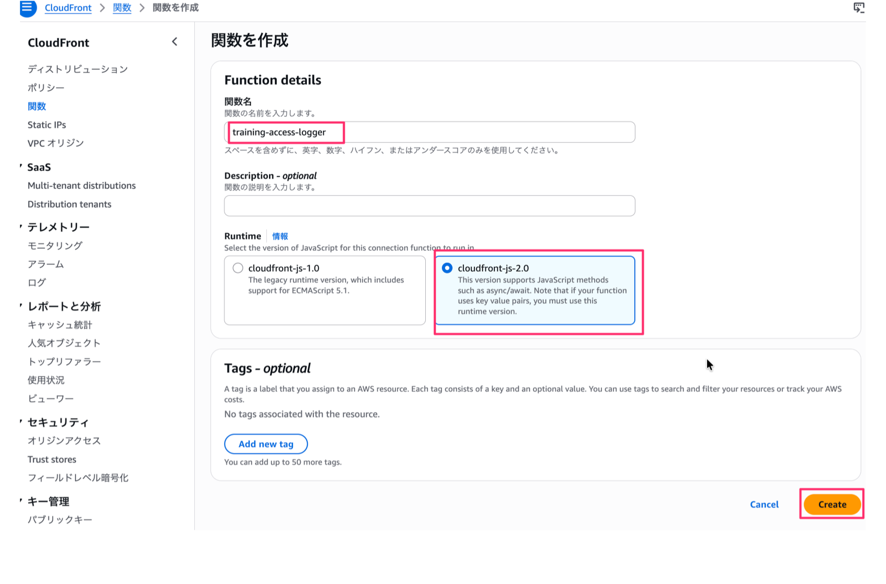

5. 「Create」をクリックし、作成成功のメッセージを確認します。

#### 2. ログを出力するコードを入力する

1. 「Build」タブを開きます。
2. `Function code` の既存コードをすべて選択し、次のコードに置き換えます。

```javascript
function handler(event) {
  var request = event.request;
  var token = request.querystring['x-token'];

  if (token && token.value) {
    console.log(
      'training-access token=' + token.value +
      ' uri=' + request.uri
    );
  }

  return request;
}
```

このコードは `x-token` がある場合だけ、トークンとアクセス先のパスをログへ出力します。リクエストは変更せず CloudFront へ戻します。

3. 「Save changes」をクリックします。
4. 保存成功のメッセージを確認します。

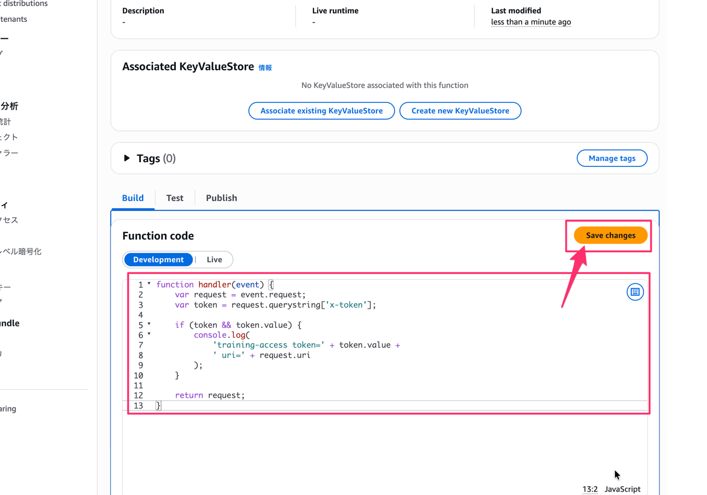

#### 3. 関数を公開する

1. 「Publish」タブをクリックします。
2. 「Publish function」をクリックします。
3. 公開成功のメッセージを確認します。

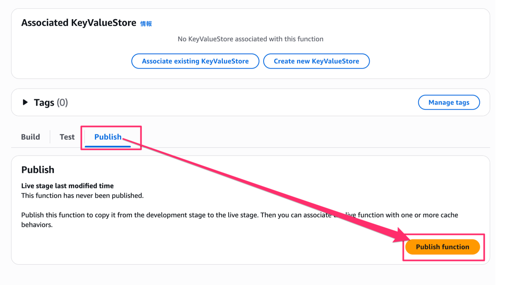

> [!IMPORTANT]
> ⚡ コードを保存しただけでは使えません。「Publish function」まで完了してから次へ進みます。

---

<a id="step-7"></a>

### 7️⃣ CloudFront Function をアクセス時に実行する

> **ログ設定の進み具合:** 🟩 🟩 ⬜ ⬜ ⬜

#### 1. ビヘイビアを編集する

1. CloudFront の「ディストリビューション」を開きます。
2. <a href="#step-3" target="_blank">手順3「CloudFront を作る」</a>で作成したディストリビューションをクリックします。
3. 「ビヘイビア」タブをクリックします。
4. パスパターンが「デフォルト `(*)`」の行を選びます。
5. 「編集」をクリックします。

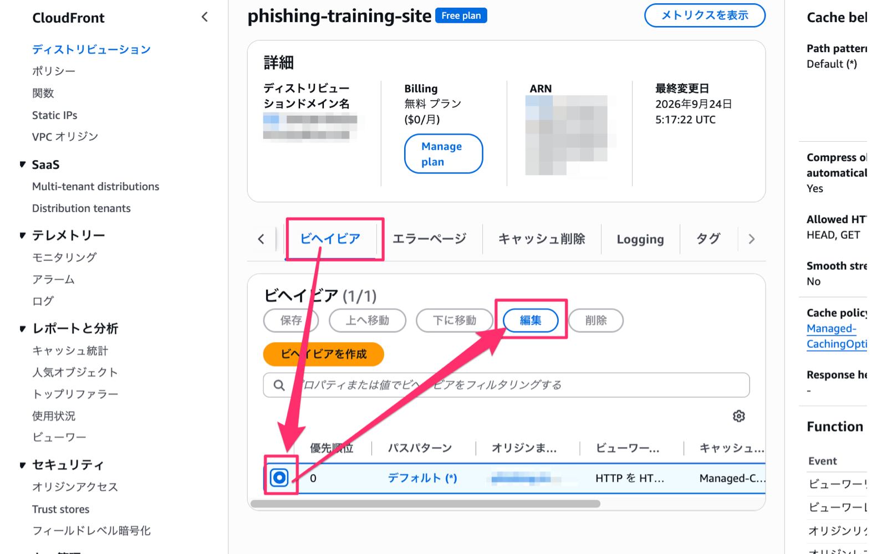

#### 2. ビューワーリクエストへ関連付ける

画面下部の「関数の関連付け - オプション」を、次のとおり設定します。

| 画面の項目 | 入力・選択するもの |
| --- | --- |
| ビューワーリクエストの関数タイプ | CloudFront Functions |
| ビューワーリクエストの関数 ARN / 名前 | `training-access-logger` |
| ビューワーレスポンス | 関連付けなし |
| オリジンリクエスト | 関連付けなし |
| オリジンレスポンス | 関連付けなし |

1. ビューワーリクエストの「関数タイプ」で「CloudFront Functions」を選びます。
2. 「関数 ARN / 名前」の `Choose a function` で、作成した関数名 `training-access-logger` を選びます。
3. 「Save changes」をクリックします。
4. ディストリビューションへの反映が完了するまで待ちます。

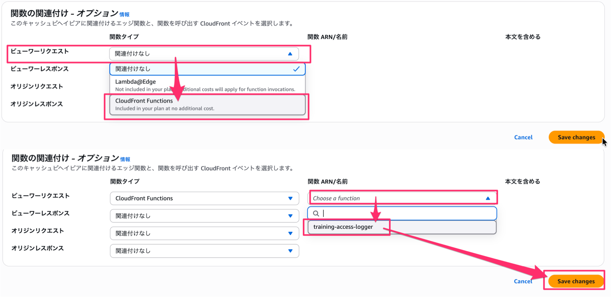

---

<a id="step-8"></a>

### 8️⃣ アクセスして CloudWatch Logs を確認する

> **ログ設定の進み具合:** 🟩 🟩 🟩 ⬜ ⬜

#### 1. `x-token` を付けてアクセスする

次の URL を新しいブラウザータブで開きます。ドメイン名は自分の値へ置き換えます。

```text
https://<ディストリビューションドメイン名>/?x-token=test-001
```

「セキュリティ訓練ページ」が表示されることを確認します。

> [!IMPORTANT]
> 🔒 `x-token` には氏名、メールアドレス、社員番号などを直接入れず、訓練専用のランダムな値を使います。URL はブラウザー履歴や各種ログへ残る可能性があります。

#### 2. CloudWatch を `us-east-1` で開く

1. AWS 画面上部の検索欄から CloudWatch を開きます。
2. 画面右上のリージョン名をクリックします。
3. 「米国東部（バージニア北部）」`us-east-1` を選びます。

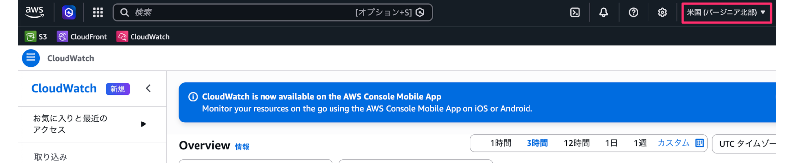

> [!IMPORTANT]
> 🌏 ここでは S3 を作成した利用リージョンではなく、必ず `us-east-1` を選びます。

#### 3. ロググループを確認する

1. CloudWatch の左メニューで「ログ」を開きます。
2. 「ログ管理」をクリックします。

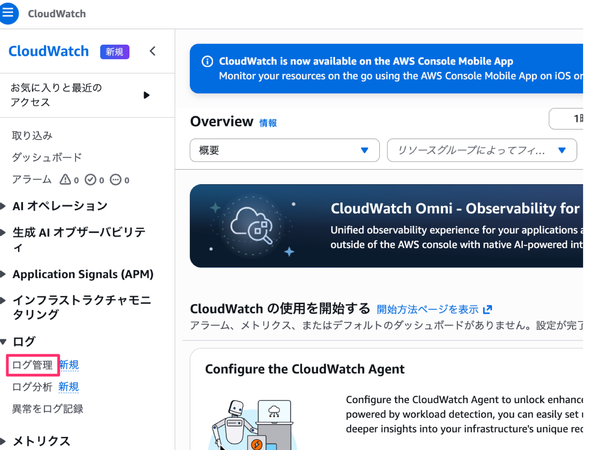

3. 次のロググループを探します。

```text
/aws/cloudfront/function/training-access-logger
```

4. 見つからない場合は数分待ち、更新ボタンをクリックします。
5. ロググループ名のリンクをクリックします。

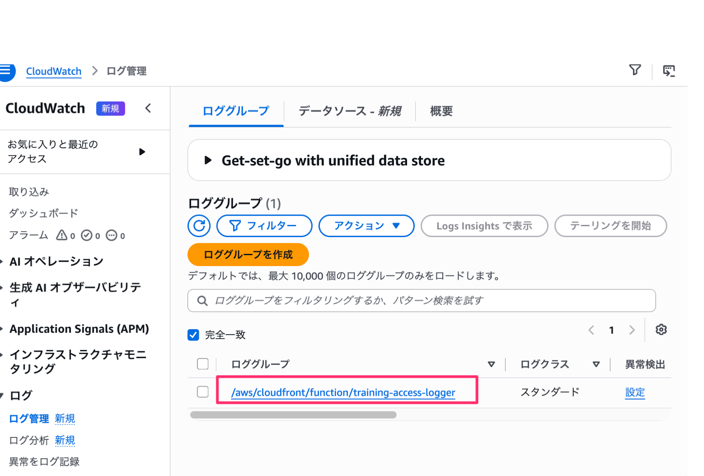

#### 4. ログストリームを確認する

1. 「ログストリーム」タブに1件以上のログストリームがあることを確認します。
2. 最新のログストリームをクリックします。
3. ログイベントに次のようなメッセージがあることを確認します。

```text
training-access token=test-001 uri=/
```

> [!NOTE]
> ⏳ ログの反映には数分かかることがあります。アクセス回数とログレコード数が常に完全一致するとは限りません。

---

<a id="step-9"></a>

### 9️⃣ トークンと氏名のルックアップテーブルを作る

> **ログ設定の進み具合:** 🟩 🟩 🟩 🟩 ⬜

#### 1. CSV ファイルを確認する

このプロジェクトの [`training_users.csv`](./training_users.csv) を使います。ファイルの条件は次のとおりです。

- 文字コードは UTF-8
- 先頭にヘッダー行がある
- ファイルサイズは最大 10 MB
- ヘッダーは `token,name`

確認用の内容は次のとおりです。

```csv
token,name
test-001,テスト太郎
test-002,テスト花子
test-003,テスト二郎
```

> [!CAUTION]
> 🔐 実際の氏名を含む CSV は個人情報として扱ってください。公開リポジトリへコミットせず、組織のルールに沿った端末・保管場所で管理します。README の画像には確認用の架空データだけを使用しています。

#### 2. ルックアップテーブルの管理画面を開く

1. CloudWatch が `us-east-1` になっていることを確認します。
2. 左メニューの「セットアップ」→「設定」をクリックします。
3. CloudWatch 設定の「ログ」タブをクリックします。

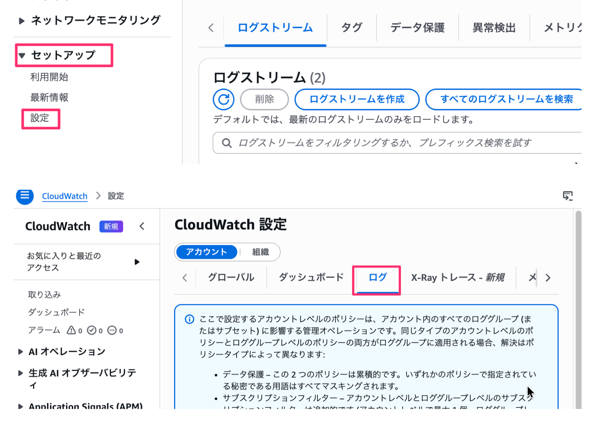

4. 「ルックアップテーブル」までスクロールし、「管理」をクリックします。
5. 「ルックアップテーブルを作成」をクリックします。

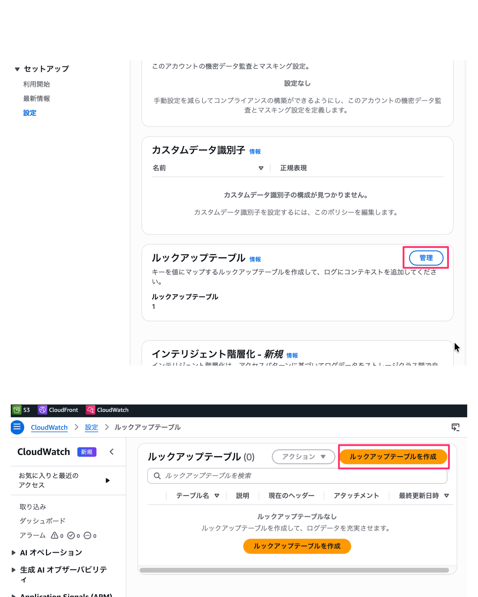

#### 3. CSV とテーブル名を設定する

1. `CSV ファイル` の「ファイルを選択」をクリックします。
2. `training_users.csv` を選びます。
3. `KMS キー - オプション` は、組織から指定がなければ空欄にします。
4. `テーブル名` に `training_users` と入力します。
5. `テーブルの説明 - オプション` は空欄にします。
6. 「ルックアップテーブルを作成」をクリックします。
7. 一覧に `training_users` が表示され、現在のヘッダーが `token, name` になっていることを確認します。

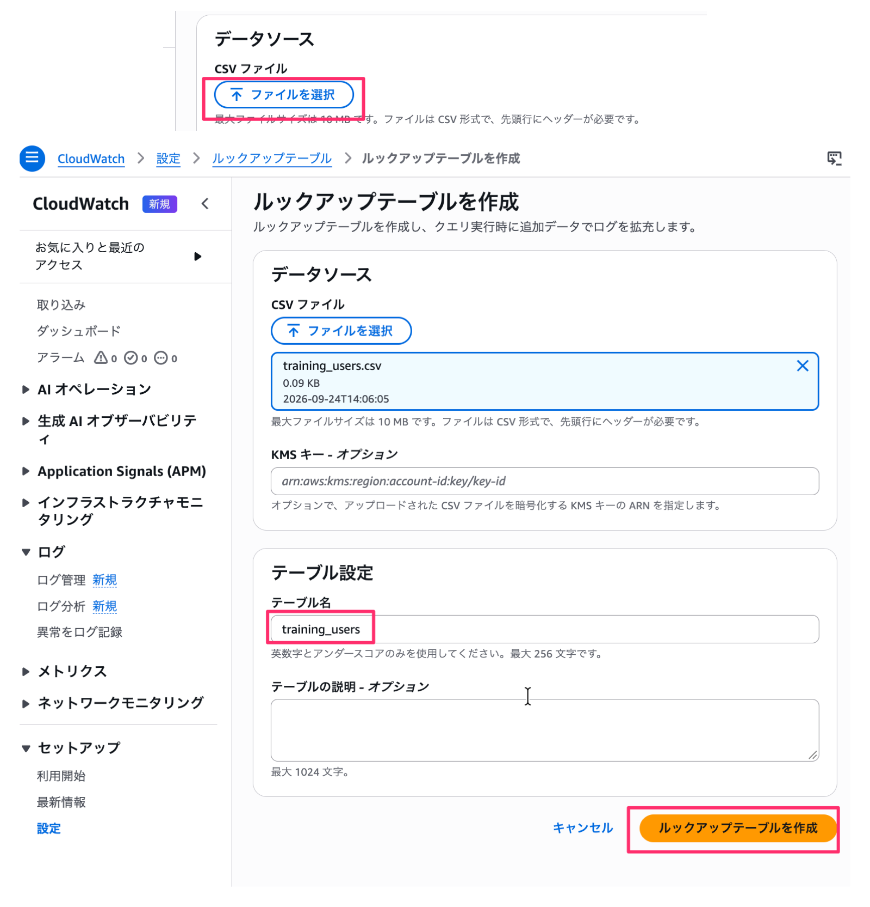

> [!IMPORTANT]
> ✍️ CSV ファイル名は `training_users.csv`、ルックアップテーブル名は拡張子なしの `training_users` です。Logs Insights のクエリではテーブル名を使います。

---

<a id="step-10"></a>

### 🔟 Logs Insights でアクセス結果を表示する

> **ログ設定の進み具合:** 🟩 🟩 🟩 🟩 🟩

#### 1. ログ分析を開いてロググループを選ぶ

1. CloudWatch が `us-east-1` になっていることを確認します。
2. 左メニューの「ログ」→「ログ分析」をクリックします。
3. 検索欄をクリックし、次のロググループを選びます。

```text
/aws/cloudfront/function/training-access-logger
```

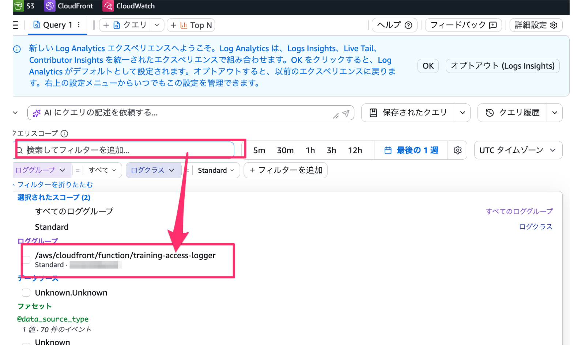

4. クエリスコープに選んだロググループが追加されたことを確認します。

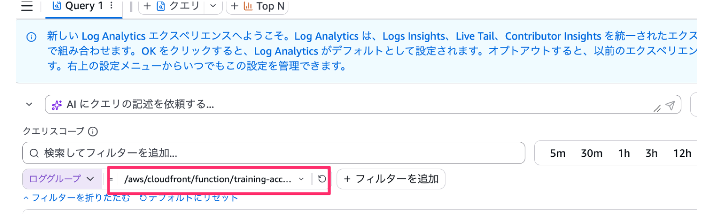

#### 2. 表示タイムゾーンと対象期間を決める

1. 画面右上のタイムゾーンを「ローカルタイムゾーン」に変更します。
2. アクセス確認を行った時刻を含む対象期間を選びます。最初は「最後の1時間」または「最後の3時間」が目安です。

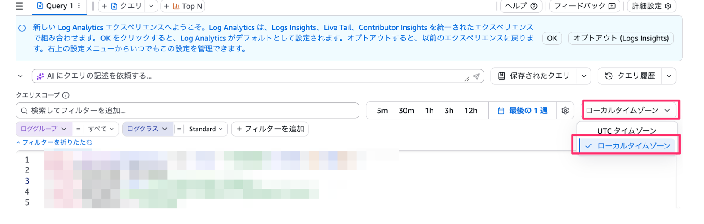

#### 3. クエリを入力して実行する

ロググループを選ぶと、エディタの先頭に `SOURCE` で始まる行が自動作成されることがあります。その行は削除せず、次のクエリを後ろへ追加します。

```text
fields @timestamp, @message
| filter @message like /training-access token=/
| parse @message logfmt as lf
| fields
    @timestamp,
    formatDate(@timestamp, "%Y/%m/%d %H:%M:%S", "Asia/Tokyo") as accessTime,
    trim(lf.token) as trainingToken
| filter trainingToken != "missing"
| lookup training_users token as trainingToken OUTPUT name
| display accessTime, trainingToken, name
| sort @timestamp desc
| limit 10000
```

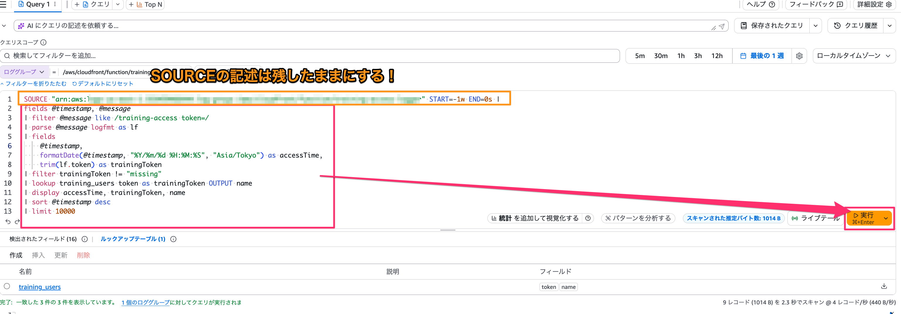

1. エディタにクエリを入力します。
2. `SOURCE` 行がある場合は先頭に残っていることを確認します。
3. 「実行」をクリックします。
4. 結果に `accessTime`、`trainingToken`、`name` が表示されることを確認します。
5. `test-001`〜`test-003` の行の`name`に 対応する名前が表示されたら成功です。🎉

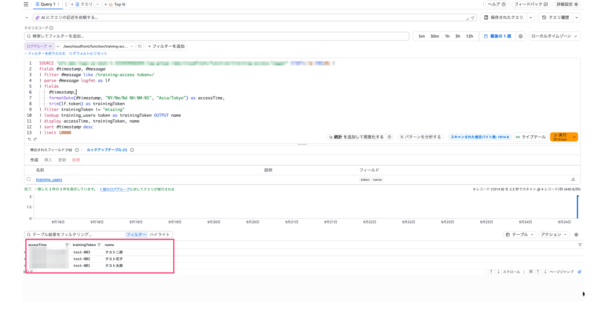

> [!NOTE]
> 🕒 上のクエリは `accessTime` を日本時間で表示するため、`Asia/Tokyo` を指定しています。別のタイムゾーンで表示する場合は、利用者の IANA タイムゾーン名へ置き換えてください。

> [!WARNING]
> 📊 アクセス直後に結果が表示されない場合は数分待って再実行し、対象期間も確認します。CloudFront Functions のログはベストエフォートのため、まれに配信されないことがあります。

> [!WARNING]
> 💰 CloudWatch Logs、Logs Insights、ルックアップテーブルは、保存量やクエリのスキャン量などに応じて料金が発生する場合があります。対象期間を必要以上に広げず、AWS 画面の料金案内を確認してください。

---

<a id="step-11"></a>

### 1️⃣1️⃣ 任意: クエリをダッシュボードへ保存する

毎回クエリを入力せずに確認したい場合だけ行います。

1. Logs Insights でクエリを実行します。
2. 「実行」の右にあるメニューを開きます。
3. 「ダッシュボードに追加」をクリックします。

    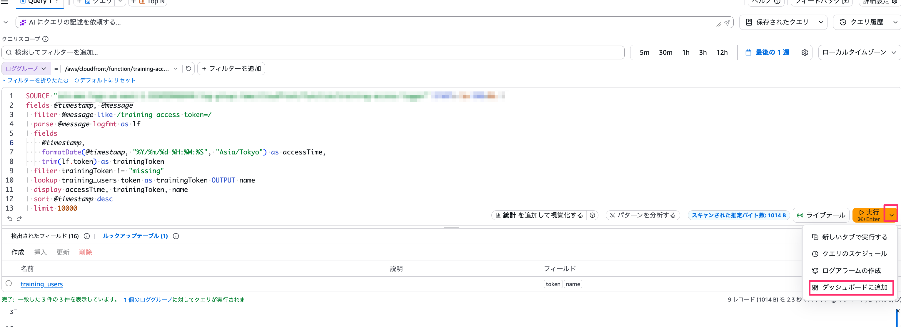

4. 任意のダッシュボード名を入力して追加します。
5. ダッシュボード画面上部の「ダッシュボードの保存」をクリックします。

    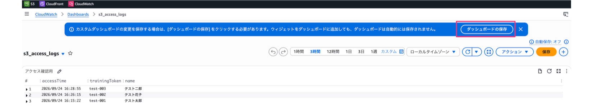

6. CloudWatch の左メニューにある「ダッシュボード」から開けることを確認します。

    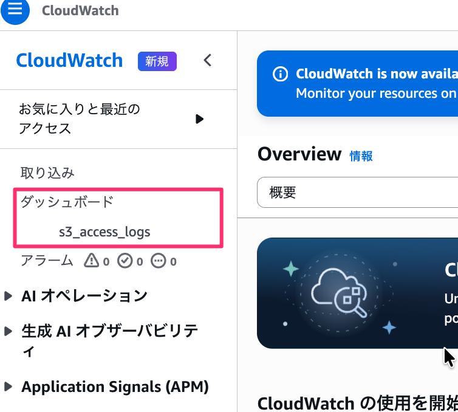

> [!NOTE]
> 📅 ダッシュボードを開いたときも、画面右上の対象期間を必要に応じて変更してください。
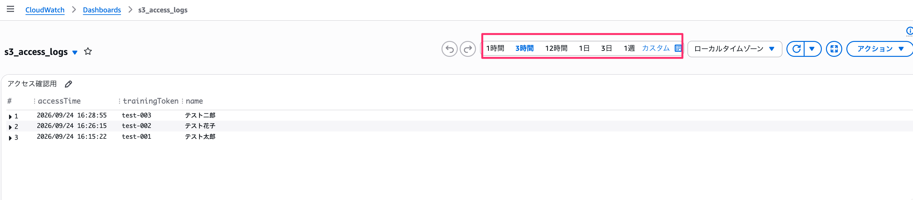


---

### 🔄 補足: 公開後に `index.html` を変更した場合

#### 1. S3 に上書きアップロードする

1. S3 で Web ページを保存しているバケットを開きます。
2. 「オブジェクト」タブの「アップロード」をクリックします。
3. 「ファイルを追加」から更新した `index.html` を選びます。
4. 同名ファイルを上書きすることを確認し、「アップロード」をクリックします。


#### 2. CloudFront のキャッシュを削除する

1. CloudFront で作成したディストリビューションを開きます。
2. 「キャッシュ削除」タブで「キャッシュ削除を作成」をクリックします。


3. `Selection method` は `By paths` のままにします。
4. `Object paths to invalidate` に `/*` と入力します。
5. 「キャッシュ削除を作成」をクリックし、完了まで待ちます。


---

<a id="check"></a>

## ✅ 最後の確認

- [ ] S3 の「パブリックアクセスをすべてブロック」が ON
- [ ] S3 バケットの中に `index.html` がある
- [ ] CloudFront の `S3 origin` に正しいバケットが表示されている
- [ ] `Allow private S3 bucket access to CloudFront` が ON
- [ ] `Default root object` が `index.html`
- [ ] CloudFront の HTTPS URL で Web ページを開ける
- [ ] CloudFront Function `training-access-logger` が公開済み
- [ ] デフォルトビヘイビアのビューワーリクエストに関数を関連付けた
- [ ] `?x-token=test-001` を付けてアクセスした
- [ ] CloudWatch を `us-east-1` で開いている
- [ ] `/aws/cloudfront/function/training-access-logger` ロググループがある
- [ ] ログに `training-access token=test-001` がある
- [ ] `training_users` ルックアップテーブルがある
- [ ] ルックアップテーブルのヘッダーが `token, name`
- [ ] Logs Insights の結果に `accessTime`、`trainingToken`、`name` が表示される
- [ ] ログがベストエフォートであり、完全なアクセス証跡ではないと理解している

---

<a id="help"></a>

## 🆘 うまくいかないとき

| 画面に出るもの・困っていること | 確認すること |
| --- | --- |
| CloudFront で `403` | `Default root object`、S3 origin、S3 のプライベートアクセス設定を確認 |
| CloudFront で `404` | S3 バケット内に `index.html` があるか確認 |
| S3 の URL を開けない | 正常な動き。S3 ではなく CloudFront の URL を開く |
| 古いページが表示される | S3 への上書きと CloudFront の `/*` キャッシュ削除を確認 |
| 関数をビヘイビアで選べない | 関数名、`Publish function` の完了、CloudFront の反映状況を確認 |
| 関数の関連付け後にページを開けない | コードを貼り直し、`return request;` があるか確認して再公開 |
| ロググループが見つからない | CloudWatch が `us-east-1` か、関数の関連付け後に `x-token` 付き URL へアクセスしたか確認 |
| ログストリームがない | 数分待って更新。関数の関連付けと公開状態も確認 |
| ログに `training-access` がない | URL が `?x-token=test-001` か確認。`token` ではなく `x-token` を使う |
| ルックアップテーブルを作成できない | CSV が UTF-8、ヘッダーあり、10 MB 以下か確認 |
| クエリで `training_users` が見つからない | テーブルと Logs Insights が同じ `us-east-1` か、テーブル名に `.csv` を付けていないか確認 |
| クエリに構文エラーが出る | 自動作成された `SOURCE` 行を残し、その後ろへクエリ全文を貼り直す |
| `name` が空欄 | CSV の `token` とログの `x-token` が完全に一致しているか確認 |
| 結果が0件 | 対象期間を広げ、数分待って再実行。ロググループとリージョンも確認 |
| 時刻が期待と違う | `formatDate` の `Asia/Tokyo` を目的の IANA タイムゾーン名に変更 |

---

## 🔒 安全に使うために

- 訓練の許可を得た人だけが使用してください。
- パスワード、氏名、メールアドレスを入力させる画面は作らないでください。
- URL の `x-token` には、個人情報や認証情報を直接入れないでください。
- トークンは推測しにくい訓練専用のランダムな値にし、訓練ごとに使い回さないでください。
- 実際の氏名を含む `training_users.csv` は公開リポジトリ、README、外部チャットへ貼らないでください。
- CloudWatch Logs とルックアップテーブルの閲覧権限、保存期間、削除日を組織内で決めてください。
- CloudFront Function には必要な `x-token` と URI だけをログ出力し、Cookie、認証ヘッダー、個人情報を出力しないでください。
- S3 のパブリックアクセスは、すべてブロックしてください。
- CloudWatch Logs は完全なアクセス証跡ではありません。厳密な監査が必要な場合は、組織のセキュリティ担当者と別の記録方法を設計してください。
- 訓練が終わったら、不要になった CloudFront、CloudFront Function、S3、CloudWatch のロググループ、ルックアップテーブル、ダッシュボードを削除してください。
