<div align="center">

<h1>🎯 phishing-simulation</h1>

<h3>AWS で作る、標的型攻撃メールの訓練用ページ</h3>

<p>📦 <strong>Amazon S3</strong> ・ 🌐 <strong>Amazon CloudFront</strong> ・ 🗃️ <strong>Amazon DynamoDB</strong> ・ ⚙️ <strong>AWS Lambda</strong> ・ 🔑 <strong>AWS IAM</strong> ・ 📄 <strong>HTML</strong></p>

<p>AWS に詳しくない方でも作業できるように、<br>
押すボタンや入力内容を順番に説明します。</p>

</div>

---

> [!CAUTION]
> ⚠️ 必ず会社や組織の許可を得てから実施してください。パスワードや個人情報を入力させるページは作らないでください。

<p align="center">
  <a href="#overview">🗺️ しくみ</a> ・
  <a href="#words">📖 用語集</a> ・
  <a href="#steps">🚀 作り方</a> ・
  <a href="#dynamodb">🗃️ 追加設定</a> ・
  <a href="#check">✅ 最後の確認</a> ・
  <a href="#help">🆘 困ったとき</a>
</p>

<a id="overview"></a>

## 🗺️ 作るしくみ

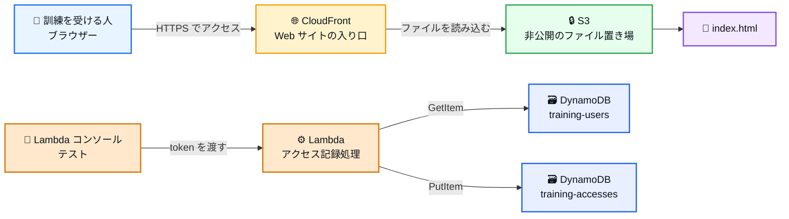
```mermaid
flowchart LR
    A["👤 訓練を受ける人<br/>ブラウザー"]
    B["🌐 CloudFront<br/>Web サイトの入り口"]
    C["🔒 S3<br/>非公開のファイル置き場"]
    D["📄 index.html"]
    E["🧪 Lambda コンソール<br/>テスト"]
    F["⚙️ Lambda<br/>アクセス記録処理"]
    G["🗃️ DynamoDB<br/>training-users"]
    H["🗃️ DynamoDB<br/>training-accesses"]

    A -->|HTTPS でアクセス| B
    B -->|ファイルを読み込む| C
    C --> D
    E -->|token を渡す| F
    F -->|GetItem| G
    F -->|PutItem| H

    classDef person fill:#e8f4ff,stroke:#1f6feb,color:#0d1117,stroke-width:2px;
    classDef cloud fill:#fff3cd,stroke:#f59e0b,color:#0d1117,stroke-width:2px;
    classDef storage fill:#e6ffed,stroke:#2da44e,color:#0d1117,stroke-width:2px;
    classDef file fill:#f3e8ff,stroke:#8250df,color:#0d1117,stroke-width:2px;
    classDef compute fill:#ffe8cc,stroke:#d97706,color:#0d1117,stroke-width:2px;
    classDef database fill:#e8f0ff,stroke:#2563eb,color:#0d1117,stroke-width:2px;

    class A person;
    class B cloud;
    class C storage;
    class D file;
    class E,F compute;
    class G,H database;
```

- `S3` に Web ページのファイルを保存します。
- `CloudFront` を Web サイトの入り口にします。
- S3 は直接公開しません。CloudFront を通してページを表示します。
- `Lambda` は `training-users` のトークンを確認し、`training-accesses` にアクセス日時を書き込みます。
- この手順では Lambda コンソールから動作確認します。Web ページから Lambda を自動実行する接続は、まだ作成しません。

### 📍 作業の流れ

| 1️⃣ 保存場所を作る | 2️⃣ HTML を入れる | 3️⃣ Web 公開の入り口を作る | 4️⃣ トップページを決める | 5️⃣ 表示を確認する |
| :---: | :---: | :---: | :---: | :---: |
| 📦 S3 | 📄 `index.html` | 🌐 CloudFront | 🏠 Default root object | 🎉 完成 |

### 📍 追加設定の流れ

| 6️⃣ 利用者テーブル | 7️⃣ 履歴テーブル | 8️⃣ token 表示 | 9️⃣ 権限付与 | 🔟 Lambda コード | 1️⃣1️⃣ 動作確認 |
| :---: | :---: | :---: | :---: | :---: | :---: |
| `training-users` | `training-accesses` | URL の値を確認 | IAM ポリシー | 読み取り・書き込み | DynamoDB を確認 |

---

<a id="words"></a>

## 📖 よく出てくる言葉

| 言葉 | かんたんな意味 |
| --- | --- |
| AWS マネジメントコンソール | ブラウザーから AWS のサービスを設定する管理画面 |
| リージョン | AWS の設備がある地域。この手順では、利用者が選んだ1つのリージョンを使う |
| S3 | ファイルを保存する場所 |
| バケット | S3 の中に作る、ファイル入れ |
| CloudFront | S3 のファイルを Web サイトとして表示するサービス |
| ディストリビューション | CloudFront で作る Web サイトの設定 |
| オリジン | CloudFront がファイルを取りに行く場所。この手順では S3 |
| デプロイ | 設定を AWS に反映すること |
| DynamoDB | トークンと氏名、トークンとアクセス日時などを保存するデータベース |
| テーブル | DynamoDB のデータをまとめて保存する場所 |
| パーティションキー | DynamoDB で項目を識別し、保存場所を決めるキー |
| ソートキー | 同じパーティションキーを持つ項目を並べ分けるキー |
| キャッシュ削除 | CloudFront に残っている古いファイルを無効にする操作 |
| Lambda | サーバーを用意せずにコードを実行するサービス |
| IAM | AWS のサービスや利用者に、必要な操作だけを許可する仕組み |
| 実行ロール | Lambda がほかの AWS サービスを操作するときに使う権限 |
| ARN | AWS のリソースを一意に識別する文字列 |
| インラインポリシー | 1つのロールなどに直接追加する権限設定 |

---

## ✅ 作業を始める前に

次の4点を確認してください。

- AWS マネジメントコンソールにサインインできる
- S3、CloudFront、DynamoDB、Lambda、IAM を設定できる権限がある
- 訓練の対象者、実施日、問い合わせ先が決まっている
- S3、DynamoDB、Lambda を作成するリージョンを1つ決めている

> [!NOTE]
> 💡 AWS の画面は変更されることがあります。ボタンの場所が少し違っても、同じ名前の項目を探してください。

> [!TIP]
> 🧭 別の AWS サービスへ移動するときは、画面上部の検索欄にサービス名を入力し、検索結果をクリックします。左メニューが見えない場合は、画面左上のメニューアイコンをクリックしてください。

### 🌏 利用リージョンを決める

この README では、ここで選んだリージョンを「**利用リージョン**」と呼びます。組織のルール、データの保管場所、利用できるサービスなどに合わせて選んでください。

| 記入するもの | 例 |
| --- | --- |
| 利用リージョン名 | アジアパシフィック（東京） |
| 利用リージョンコード | `ap-northeast-1` |

以降の作業で迷わないように、実際に選んだリージョン名とリージョンコードをメモしておきます。東京以外を選んでも、この手順を利用できます。

> [!IMPORTANT]
> 🌏 S3、DynamoDB、Lambda は、すべて同じ利用リージョンに作成してください。DynamoDB と Lambda のリージョンが異なると、Lambda からテーブルを見つけられません。各サービスを開くたびに、AWS 画面右上が利用リージョンになっていることを確認します。CloudFront と IAM はリージョンを選ばないグローバルサービスです。

---

<a id="steps"></a>

## 🚀 作り方

### 1️⃣ S3 にバケットを作る

> **進み具合:** 🟩 ⬜ ⬜ ⬜ ⬜

#### 1. S3 の画面を開く

1. AWS マネジメントコンソールにサインインします。
2. 画面上部の検索欄に `S3` と入力します。
3. 検索結果の「S3」をクリックします。
4. 左メニューの「バケット」→「汎用バケット」の順にクリックします。
5. 「バケットを作成」をクリックします。


#### 2. バケットの設定を入力する

画面の項目を、上から順に設定します。

| 画面の項目 | 選ぶもの・入力するもの | 説明 |
| --- | --- | --- |
| AWS リージョン | 事前に決めた利用リージョン | DynamoDB と Lambda にも同じリージョンを使う |
| バケットタイプ | 汎用 | この手順で使うタイプ |
| バケット名前空間 | グローバル名前空間 | 変更しない |
| バケット名 | `<training-site-random-suffix>` | 自分で決めた名前に置き換える |
| オブジェクト所有者 | ACL 無効（推奨） | そのまま |
| パブリックアクセス | すべてブロックを ON | 必ず ON にする |
| バージョニング | 無効 | そのまま |
| タグ | なし | 追加しない |
| 暗号化 | SSE-S3 | そのまま |
| バケットキー | 初期設定のまま | 変更しない |
| 詳細設定 | 初期設定のまま | 変更しない |

> [!IMPORTANT]
> 🛠️ バケット名は、AWS 全体でほかの人と同じ名前を使えません。「この名前は使えません」と表示されたら、名前の後ろにランダムな英数字を追加してください。

#### 3. バケットを作る

1. 「パブリックアクセスをすべてブロック」が ON になっていることを、もう一度確認します。
2. 画面下部の「バケットを作成」をクリックします。
3. バケット一覧に、作ったバケットが表示されたら完了です。

---

### 2️⃣ `index.html` を S3 に入れる

> **進み具合:** 🟩 🟩 ⬜ ⬜ ⬜

#### 1. `index.html` を用意する

このプロジェクトフォルダーにある [`index.html`](./index.html) を使います。中身は次のとおりです。

```html
<!DOCTYPE html>
<html lang="ja">
<head>
  <meta charset="UTF-8">
  <title>Training Site</title>
</head>
<body>
  <h1>セキュリティ訓練ページ</h1>
  <p>このページは標的型訓練用です。</p>

  <p id="token-display"></p>

  <script>
    const params = new URLSearchParams(window.location.search);
    const token = params.get('token');

    document.getElementById('token-display').textContent =
      token ? `token = ${token}` : 'token が指定されていません';
  </script>
</body>
</html>
```

> [!IMPORTANT]
> 📄 ファイル名は `index.html` です。`Index.html` や `index.htm` に変えないでください。

#### 2. S3 にアップロードする

1. AWS 画面上部の検索欄に `S3` と入力します。
2. 検索結果の「S3」をクリックします。
3. 左メニューの「バケット」→「汎用バケット」の順にクリックします。
4. 手順1で作ったバケット名をクリックします。
5. 「オブジェクト」タブの「アップロード」をクリックします。
6. 「ファイルを追加」をクリックします。
7. パソコンに保存されている `index.html` を選びます。
8. 画面に `index.html` が表示されたら、右下の「アップロード」をクリックします。
9. 緑色の成功メッセージが表示されたら完了です。
10. バケットの中に `index.html` が表示されていることを確認します。

> [!NOTE]
> 💡 この時点で S3 の URL を開けなくても正常です。次の手順で CloudFront を設定します。

---

### 3️⃣ CloudFront を作る

> **進み具合:** 🟩 🟩 🟩 ⬜ ⬜

#### 1. CloudFront の画面を開く

1. AWS 画面上部の検索欄に `CloudFront` と入力します。
2. 検索結果の「CloudFront」をクリックします。
3. 定額プランの案内が表示されたら、「定額ディストリビューションを作成」をクリックします。


4. 「Flat-rate plans」を選びます。
5. 無料プランの「Choose 無料」をクリックします。

> [!WARNING]
> 💰 画面に料金が表示されたら、作成する前に必ず確認してください。画面が画像と違う場合は、自分の画面に表示される案内に従ってください。

<a id="cloudfront-distribution-name"></a>

#### 2. 基本設定を入力する

「Get started」画面で設定します。

| 画面の項目 | 入力・選択するもの |
| --- | --- |
| Distribution name | 好きな名前。例: `<training-distribution>` |
| Description | 何も入力しない |
| Distribution type | Single website configuration |
| Route 53 managed domain | 何も入力しない |

入力できたら、「Next」をクリックします。

#### 3. S3 を選ぶ

「Specify origin」画面で設定します。

| 画面の項目 | 入力・選択するもの |
| --- | --- |
| Origin type | Amazon S3 |
| S3 origin | 「Browse S3」から、先ほど作ったバケットを選ぶ |
| Origin path | 何も入力しない |
| Allow private S3 bucket access to CloudFront | ON のまま |
| Origin settings | Use recommended origin settings |
| Cache settings | Use recommended cache settings tailored to serving S3 content |

S3 バケットの選び方は次のとおりです。

1. `S3 origin` の「Browse S3」をクリックします。
2. 先ほど作ったバケットを選びます。
3. 「Choose」をクリックします。
4. `S3 origin` に選んだバケットが表示されたことを確認します。
5. 「Next」をクリックします。

> [!IMPORTANT]
> 🔒 `Allow private S3 bucket access to CloudFront` は ON のままにしてください。S3 を直接公開せず、CloudFront からだけファイルを読めるようにするためです。

#### 4. セキュリティ画面を確認する

1. 「Enable security」画面が表示されます。
2. 有料機能の表示がある場合は、料金を確認します。
3. この手順では設定を変えず、「Next」をクリックします。

#### 5. CloudFront を作成する

1. 「Review and create」画面で、これまでの設定が表示されます。
2. `S3 origin` に正しいバケットが表示されていることを確認します。
3. 画面右下の「Create distribution」をクリックします。
4. 緑色の「新しいディストリビューションが正常に作成されました。」が表示されることを確認します。
5. 「最終変更日」が「デプロイ」になるまで待ちます。

> [!NOTE]
> ⏳ 設定の反映には時間がかかることがあります。すぐに完了しない場合は、少し待ってから画面を再読み込みしてください。

---

### 4️⃣ トップページに `index.html` を設定する

> **進み具合:** 🟩 🟩 🟩 🟩 ⬜

1. AWS 画面上部の検索欄に `CloudFront` と入力します。
2. 検索結果の「CloudFront」をクリックします。
3. 左メニューの「ディストリビューション」をクリックします。
4. ディストリビューションの一覧で、[手順3「CloudFront を作る」の「基本設定を入力する」](#cloudfront-distribution-name)で `Distribution name` に入力した名前を探し、クリックします。
5. 「一般」タブをクリックします。
6. 「設定」の右上にある「編集」をクリックします。
7. `Default root object - optional` に `index.html` と入力します。


> [!IMPORTANT]
> ✍️ `index.html` の前に `/` は付けません。`/index.html` ではなく、`index.html` と入力してください。

8. 画面下部の「変更を保存」をクリックします。
9. 緑色の「ディストリビューション設定が正常に更新されました。」が表示されることを確認します。
10. 設定の反映が終わるまで待ちます。

---

### 5️⃣ Web ページを開く

> **進み具合:** 🟩 🟩 🟩 🟩 🟩

1. AWS 画面上部の検索欄に `CloudFront` と入力し、検索結果の「CloudFront」をクリックします。
2. 左メニューの「ディストリビューション」をクリックします。
3. [手順3「CloudFront を作る」の「基本設定を入力する」](#cloudfront-distribution-name)で `Distribution name` に入力した名前を探し、クリックします。
4. 「一般」タブを開きます。
5. 「ディストリビューションドメイン名」を探します。
6. 表示されたドメイン名をコピーします。
7. 新しいブラウザータブを開き、アドレス欄に次のように入力します。`<コピーしたドメイン名>` の部分は、直前にコピーした値に置き換えてください。

```text
https://<コピーしたドメイン名>/
```

8. Enter キーを押してページを開き、「セキュリティ訓練ページ」と表示されたら成功です。🎉

---

<a id="dynamodb"></a>

## 🗃️ DynamoDB、Lambda、クエリパラメーターの追加設定

ここからは、訓練用のトークンに対応する氏名と、アクセス日時を保存するためのテーブルを作ります。その後、URL の `token` を `index.html` に表示できることを確認します。

> [!IMPORTANT]
> 🔌 手順8までの `index.html` は、URL の `token` を画面に表示するだけです。手順9以降で Lambda から DynamoDB を読み書きできるようにしますが、Web ページから Lambda を自動実行する接続は作成しません。実際に連携するには、別途 API などが必要です。

### 6️⃣ トークンと氏名のテーブルを作る

> **追加設定の進み具合:** 🟩 ⬜ ⬜ ⬜ ⬜ ⬜

#### 1. DynamoDB の画面を開く

1. ブラウザーで AWS マネジメントコンソールのタブに戻ります。閉じている場合は、もう一度サインインします。
2. 画面右上が、事前に決めた利用リージョンになっていることを確認します。違う場合は、リージョン名をクリックして利用リージョンを選びます。
3. 画面上部の検索欄に `DynamoDB` と入力します。
4. 検索結果の「DynamoDB」をクリックします。
5. 左メニューの「テーブル」をクリックします。
6. 「テーブルの作成」をクリックします。

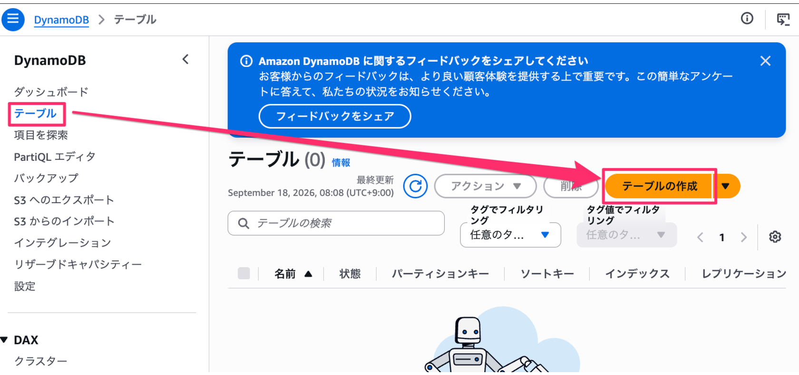

#### 2. `training-users` のキーを設定する

「テーブルの詳細」を、次のとおり設定します。

| 画面の項目 | 入力・選択するもの |
| --- | --- |
| テーブル名 | `training-users` |
| パーティションキー | `token` |
| パーティションキーのタイプ | 文字列 |
| ソートキー | 使わない |

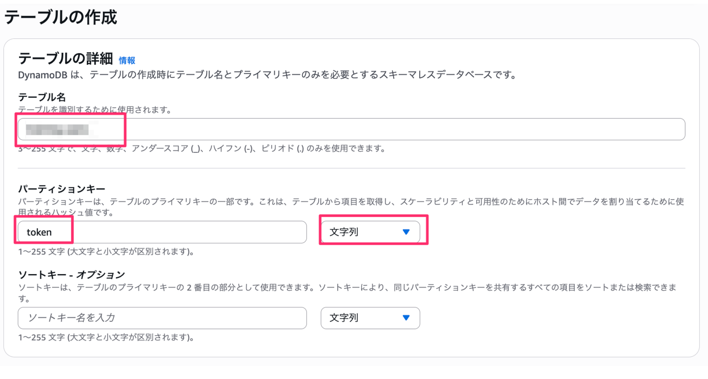

<a id="dynamodb-capacity-settings"></a>

#### 3. キャパシティーを設定する

「テーブル設定」より下を、次のとおり設定します。

| 画面の項目 | 入力・選択するもの |
| --- | --- |
| テーブル設定 | 設定をカスタマイズ |
| テーブルクラス | DynamoDB 標準 |
| キャパシティーモード | プロビジョンド |
| 読み込みキャパシティーの Auto Scaling | オフ |
| 読み込みのプロビジョンドキャパシティーユニット | `1` |
| 書き込みキャパシティーの Auto Scaling | オフ |
| 書き込みのプロビジョンドキャパシティーユニット | `1` |

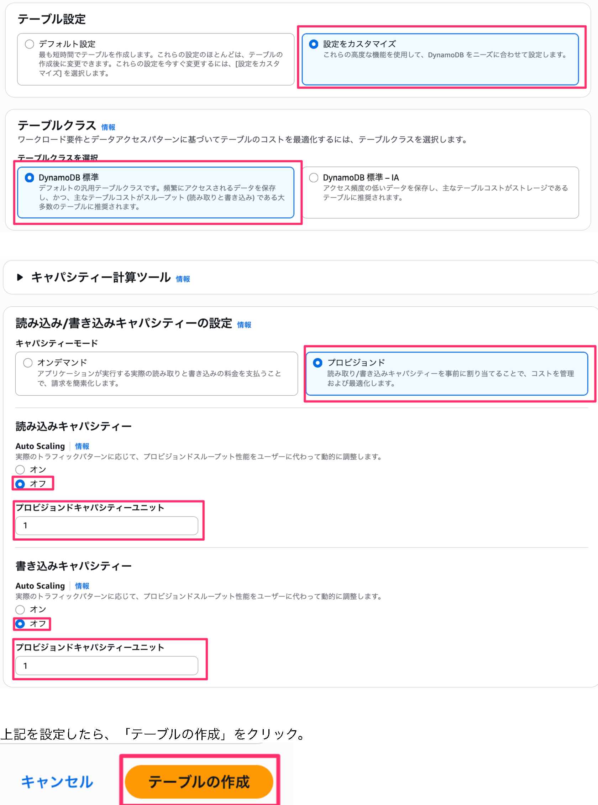

> [!WARNING]
> 💰 DynamoDB は設定や利用量によって料金が発生します。「テーブルの作成」を押す前に、AWS 画面に表示される料金案内を確認してください。

#### 4. テーブルを作る

1. 画面下部の「テーブルの作成」をクリックします。
2. 「テーブルは正常に作成されました。」と表示されるまで待ちます。
3. 一覧の状態が「アクティブ」になったら、`training-users` をクリックします。
4. 「テーブルアイテムの探索」をクリックします。

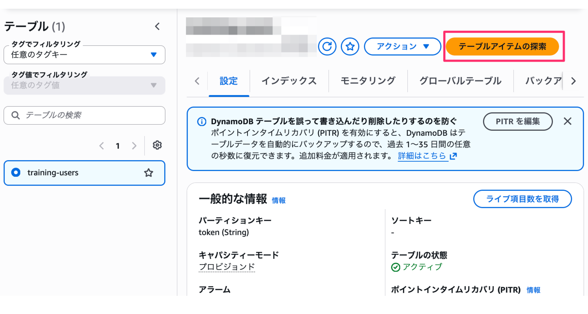

#### 5. 確認用の項目を1件作る

1. 「項目を作成」をクリックします。
2. `token` の値に `test-001` と入力します。
3. 「新しい属性の追加」→「文字列」を選びます。
4. 属性名に `name`、値に `テスト太郎` と入力します。
5. 右下の「項目を作成」をクリックします。

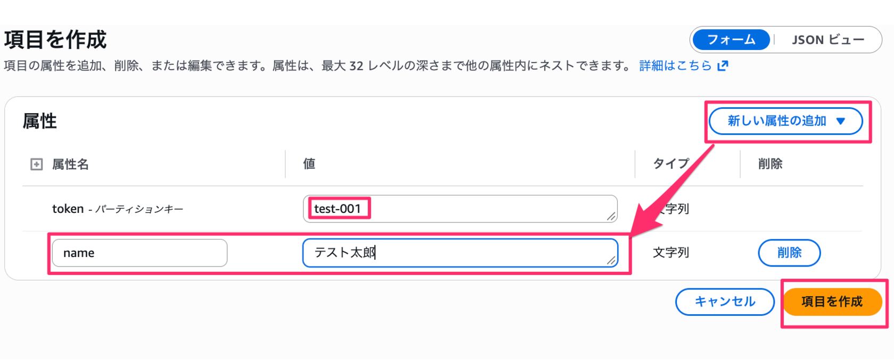

> [!NOTE]
> 🧪 `test-001` と `テスト太郎` は動作確認用の値です。本物の氏名やメールアドレスなどは、許可なく登録しないでください。

---

### 7️⃣ トークンとアクセス日時のテーブルを作る

> **追加設定の進み具合:** 🟩 🟩 ⬜ ⬜ ⬜ ⬜

#### 1. 2つ目のテーブルのキーを設定する

1. DynamoDB の左メニューにある「テーブル」をクリックして、テーブル一覧に戻ります。
2. 「テーブルの作成」をクリックします。
3. 「テーブルの詳細」を、次のとおり設定します。

| 画面の項目 | 入力・選択するもの |
| --- | --- |
| テーブル名 | `training-accesses` |
| パーティションキー | `token` |
| パーティションキーのタイプ | 文字列 |
| ソートキー | `accessedAt` |
| ソートキーのタイプ | 文字列 |

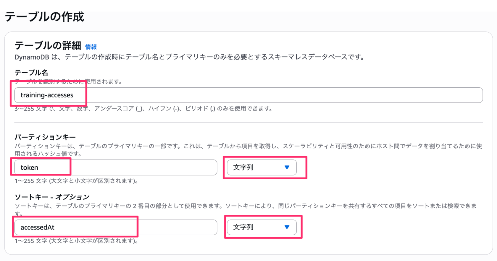

#### 2. キャパシティーを設定して作成する

1. [手順6「キャパシティーを設定する」](#dynamodb-capacity-settings)と同じく、「設定をカスタマイズ」を選びます。
2. テーブルクラスを「DynamoDB 標準」にします。
3. キャパシティーモードを「プロビジョンド」にします。
4. 読み込みと書き込みの Auto Scaling を、どちらもオフにします。
5. 読み込みと書き込みのプロビジョンドキャパシティーユニットを、どちらも `1` にします。
6. 「テーブルの作成」をクリックします。
7. 成功メッセージが表示され、状態が「アクティブ」になったら完了です。

---

### 8️⃣ `token` の表示を確認する

> **追加設定の進み具合:** 🟩 🟩 🟩 ⬜ ⬜ ⬜

手順2で S3 にアップロードした [`index.html`](./index.html) には、URL の `token` を受け取る次の処理が入っています。

```html
<p id="token-display"></p>

<script>
  const params = new URLSearchParams(window.location.search);
  const token = params.get('token');

  document.getElementById('token-display').textContent =
    token ? `token = ${token}` : 'token が指定されていません';
</script>
```

- URL に `?token=test-001` がある場合は、`token = test-001` と表示します。
- `token` がない場合は、「token が指定されていません」と表示します。

> [!IMPORTANT]
> 🔒 URL に付けるトークンには、氏名、メールアドレス、社員番号などの個人情報を直接入れないでください。訓練専用のランダムな値を使ってください。

1. ブラウザーで AWS マネジメントコンソールのタブに戻ります。
2. 画面上部の検索欄に `CloudFront` と入力し、検索結果の「CloudFront」をクリックします。
3. 左メニューの「ディストリビューション」をクリックします。
4. ディストリビューションの一覧で、[手順3「CloudFront を作る」の「基本設定を入力する」](#cloudfront-distribution-name)で `Distribution name` に入力した名前を探し、クリックします。
5. 「一般」タブを開きます。
6. 「ディストリビューションドメイン名」を探し、表示されたドメイン名をコピーします。
7. 新しいブラウザータブを開き、アドレス欄に次のように入力します。`<コピーしたドメイン名>` の部分は、直前にコピーした値に置き換えてください。

```text
https://<コピーしたドメイン名>/?token=test-001
```

8. Enter キーを押してページを開き、画面に `token = test-001` と表示されたら成功です。🎉

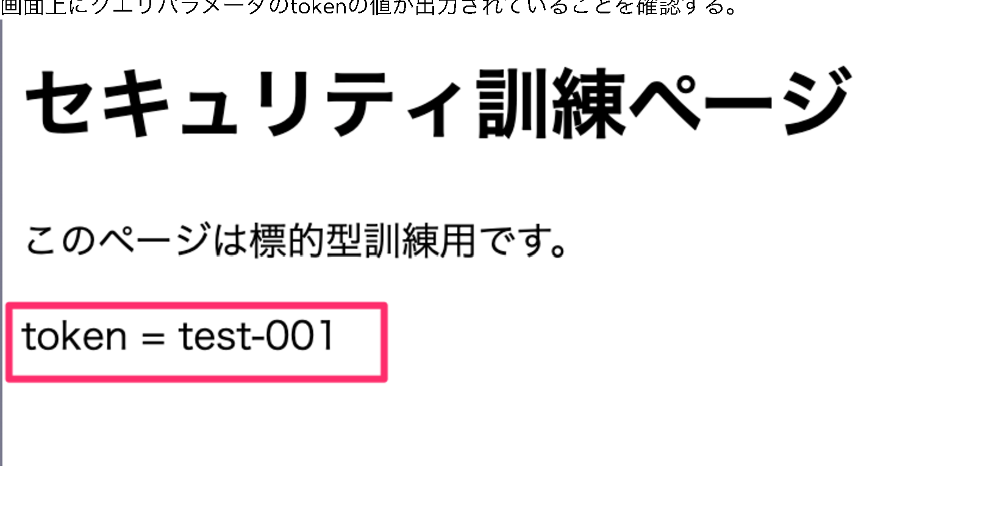

---

### 9️⃣ Lambda の実行ロールに DynamoDB 権限を付ける

> **追加設定の進み具合:** 🟩 🟩 🟩 🟩 ⬜ ⬜

#### 1. Lambda の画面を開く

1. ブラウザーで AWS マネジメントコンソールのタブに戻ります。
2. 画面右上が、DynamoDB テーブルを作った利用リージョンと同じであることを確認します。
3. 画面上部の検索欄に `Lambda` と入力します。
4. 検索結果の「Lambda」をクリックします。
5. 左メニューの「関数」をクリックします。

> [!IMPORTANT]
> 🌏 Lambda と DynamoDB は、必ず同じリージョンに作成してください。この README のコードは、Lambda と同じリージョンにある DynamoDB テーブルを探します。

#### 2. Lambda 関数を作成する、または開く

この手順では、`training-access-recorder` という Lambda 関数を使います。

1. 関数の一覧で `training-access-recorder` を探します。
2. すでにある場合は、関数名をクリックし、[「2つのテーブルの ARN をコピーする」](#copy-dynamodb-table-arns)へ進みます。
3. ない場合は、「関数の作成」をクリックします。
4. 次のとおり設定します。

| 画面の項目 | 入力・選択するもの |
| --- | --- |
| 作成方法 | 一から作成 |
| 関数名 | `training-access-recorder` |
| ランタイム | Node.js 24.x |
| アーキテクチャ | `x86_64` のまま |
| アクセス許可 | 基本的な Lambda アクセス権限を持つ新しいロールを作成 |
| 詳細設定 | 初期設定のまま。関数 URL は有効にしない |

5. 画面下部の「関数の作成」をクリックします。
6. 関数の詳細画面が表示され、作成成功のメッセージが出るまで待ちます。
7. `Getting started` が表示された場合は、`Dismiss` をクリックして閉じます。

> [!NOTE]
> 💡 新しい実行ロールは、Lambda が CloudWatch Logs にログを書き込むための基本権限を持った状態で自動作成されます。このあと、そのロールへ DynamoDB の権限だけを追加します。

<a id="copy-dynamodb-table-arns"></a>

#### 3. 2つのテーブルの ARN をコピーする

1. AWS 画面上部の検索欄に `DynamoDB` と入力し、検索結果の「DynamoDB」をクリックします。
2. 画面右上が、事前に決めた利用リージョンであることを確認します。
3. 左メニューの「テーブル」をクリックします。
4. `training-users` をクリックします。
5. 「設定」タブの「一般的な情報」にある「Amazon リソースネーム（ARN）」をコピーします。
6. `training-users` の ARN だと分かる名前を付けて、一時的に安全なメモへ貼り付けます。
7. 左メニューの「テーブル」で一覧に戻り、`training-accesses` をクリックします。
8. 同じ場所から ARN をコピーし、`training-accesses` の ARN だと分かるように同じメモへ貼り付けます。

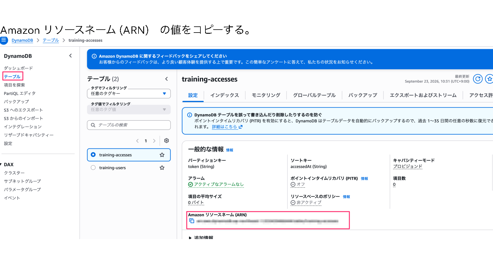

> [!CAUTION]
> 🔐 ARN には AWS アカウント ID が含まれます。README、チャット、公開リポジトリなどへ実際の値を貼り付けないでください。

#### 4. Lambda の実行ロールを開く

1. AWS 画面上部の検索欄に `Lambda` と入力し、検索結果の「Lambda」をクリックします。
2. 画面右上が、事前に決めた利用リージョンであることを確認します。
3. 左メニューの「関数」をクリックします。
4. `training-access-recorder` をクリックします。
5. 「設定」タブをクリックします。
6. 左側の「アクセス権限」をクリックします。
7. 「実行ロール」に表示されたロール名のリンクをクリックします。IAM のロール画面が、同じタブまたは新しいタブで開きます。
8. IAM のロール画面で「許可」タブを開きます。
9. 「許可を追加」→「インラインポリシーを作成」をクリックします。

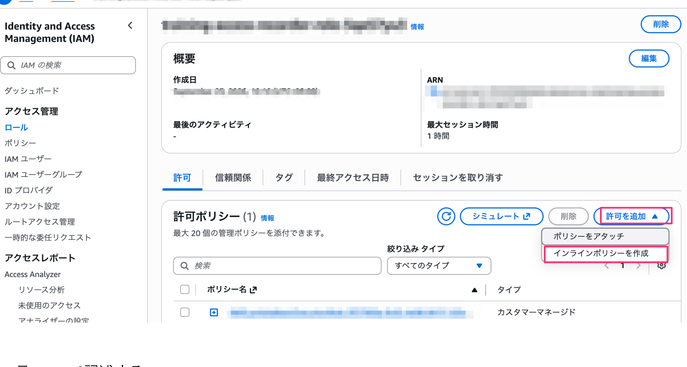

> [!IMPORTANT]
> 🔒 実行ロールに最初から付いている基本実行ポリシーは削除しないでください。ここでは新しいインラインポリシーを追加します。

#### 5. 読み取り・書き込み権限を JSON で設定する

1. ポリシーエディタの「JSON」をクリックします。
2. 既存の内容を、次の JSON に置き換えます。
3. `<training-users の ARN>` と `<training-accesses の ARN>` を、先ほどコピーした実際の ARN に置き換えます。

```json
{
  "Version": "2012-10-17",
  "Statement": [
    {
      "Effect": "Allow",
      "Action": [
        "dynamodb:GetItem"
      ],
      "Resource": "<training-users の ARN>"
    },
    {
      "Effect": "Allow",
      "Action": [
        "dynamodb:PutItem"
      ],
      "Resource": "<training-accesses の ARN>"
    }
  ]
}
```

| 許可する操作 | 対象 | 用途 |
| --- | --- | --- |
| `dynamodb:GetItem` | `training-users` | `token` が登録済みか確認する |
| `dynamodb:PutItem` | `training-accesses` | `token` とアクセス日時を記録する |

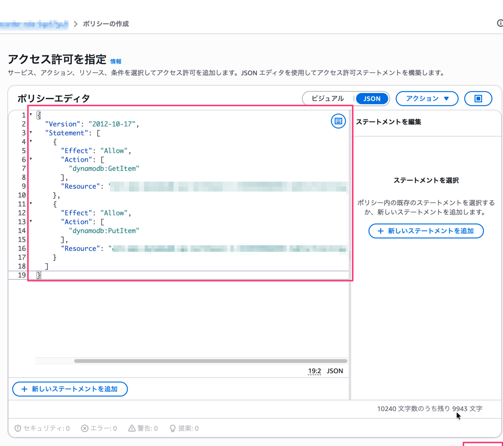

> [!IMPORTANT]
> 🔒 `Resource` を `*` にせず、2つのテーブルの ARN を個別に指定してください。Lambda に必要な操作だけを許可します。

> [!NOTE]
> ✍️ 置き換え後の `Resource` は `"arn:aws:dynamodb:<利用リージョンコード>:..."` のような値になります。たとえば東京なら `"arn:aws:dynamodb:ap-northeast-1:..."` です。実際にコピーした ARN を使用し、`<` と `>`、テーブル名の説明文が JSON に残っていないことを確認してください。

4. JSON のエラーが `0` であることを確認します。
5. 「次へ」をクリックします。

#### 6. ポリシーを作成する

1. ポリシー名に `TrainingAccessRecorderDynamoDBPolicy` と入力します。
2. 内容に `DynamoDB`、読み取り、書き込み、複数リソースが表示されていることを確認します。
3. 「ポリシーの作成」をクリックします。
4. 成功メッセージが表示され、ロールの許可一覧に `TrainingAccessRecorderDynamoDBPolicy` が追加されたことを確認します。

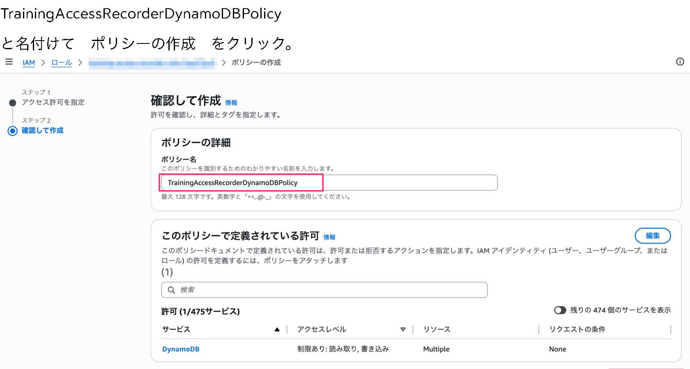

---

### 🔟 Lambda にアクセス記録処理を設定する

> **追加設定の進み具合:** 🟩 🟩 🟩 🟩 🟩 ⬜

#### 1. `index.mjs` を書き換える

1. Lambda の画面を開いていたブラウザータブに戻ります。タブを閉じた場合は、AWS 画面上部の検索欄から `Lambda` を開きます。
2. 画面右上が、事前に決めた利用リージョンであることを確認します。
3. 左メニューの「関数」をクリックします。
4. `training-access-recorder` をクリックします。
5. 「コード」タブをクリックします。
6. 「コードソース」にある `index.mjs` をクリックします。
7. エディタ内の既存コードをすべて選択し、次のコードに置き換えます。

```javascript
import {
  DynamoDBClient,
  GetItemCommand,
  PutItemCommand
} from "@aws-sdk/client-dynamodb";

const client = new DynamoDBClient({});

const USERS_TABLE = "training-users";
const ACCESSES_TABLE = "training-accesses";

export const handler = async (event) => {
  try {
    const body = event.body ? JSON.parse(event.body) : {};
    const token = body.token;

    if (!token) {
      return {
        statusCode: 400,
        body: JSON.stringify({
          message: "token is required"
        })
      };
    }

    // token が training-users に存在するか確認
    const userResult = await client.send(
      new GetItemCommand({
        TableName: USERS_TABLE,
        Key: {
          token: { S: token }
        }
      })
    );

    if (!userResult.Item) {
      return {
        statusCode: 404,
        body: JSON.stringify({
          message: "token not found"
        })
      };
    }

    // 現在時刻を取得
    const accessedAt = new Date().toISOString();

    // アクセス履歴を書き込み
    await client.send(
      new PutItemCommand({
        TableName: ACCESSES_TABLE,
        Item: {
          token: { S: token },
          accessedAt: { S: accessedAt }
        }
      })
    );

    return {
      statusCode: 200,
      body: JSON.stringify({
        message: "access recorded",
        token,
        accessedAt
      })
    };
  } catch (error) {
    console.error(error);

    return {
      statusCode: 500,
      body: JSON.stringify({
        message: "internal server error"
      })
    };
  }
};
```

#### 2. コードを反映する

1. コードの右側に `Undeployed Changes` と表示されていることを確認します。
2. 「Deploy」をクリックします。
3. 「関数 `training-access-recorder` が正常に更新されました。」と表示されるまで待ちます。
4. `Undeployed Changes` の表示が消えたことを確認します。

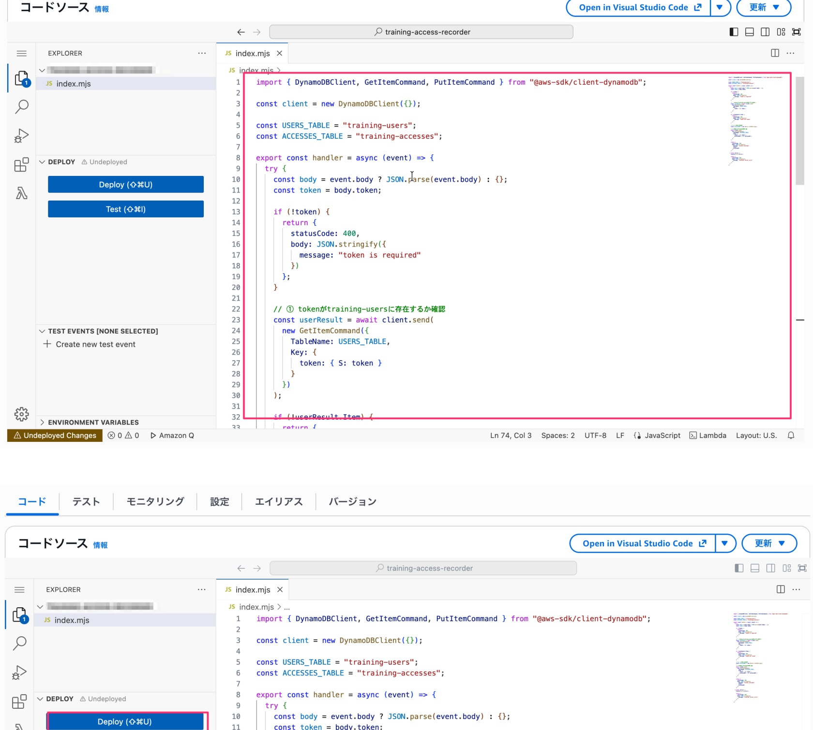

> [!NOTE]
> 💡 このコードは、登録済みの `token` だけを受け付けます。`training-users` にない値では履歴を作成しません。

---

### 1️⃣1️⃣ Lambda と DynamoDB の動作を確認する

> **追加設定の進み具合:** 🟩 🟩 🟩 🟩 🟩 🟩

#### 1. Lambda のテストイベントを実行する

1. Lambda の `training-access-recorder` を開いたまま、「テスト」タブをクリックします。別の画面に移動している場合は、Lambda の「関数」一覧から `training-access-recorder` を開き直します。
2. 「テストイベント」で「新しいイベントを作成」を選びます。
3. 呼び出しタイプは「同期」、イベント共有の設定は「プライベート」のままにします。
4. イベント名は任意の名前を入力します。例: `MyEventName`
5. テンプレートが表示されている場合は、そのままで構いません。
6. 「イベント JSON」に表示されている内容をすべて削除し、次の内容を入力します。

```json
{
  "body": "{\"token\":\"test-001\"}"
}
```

7. 「保存」または「変更を保存」をクリックします。
8. 「テスト」をクリックします。

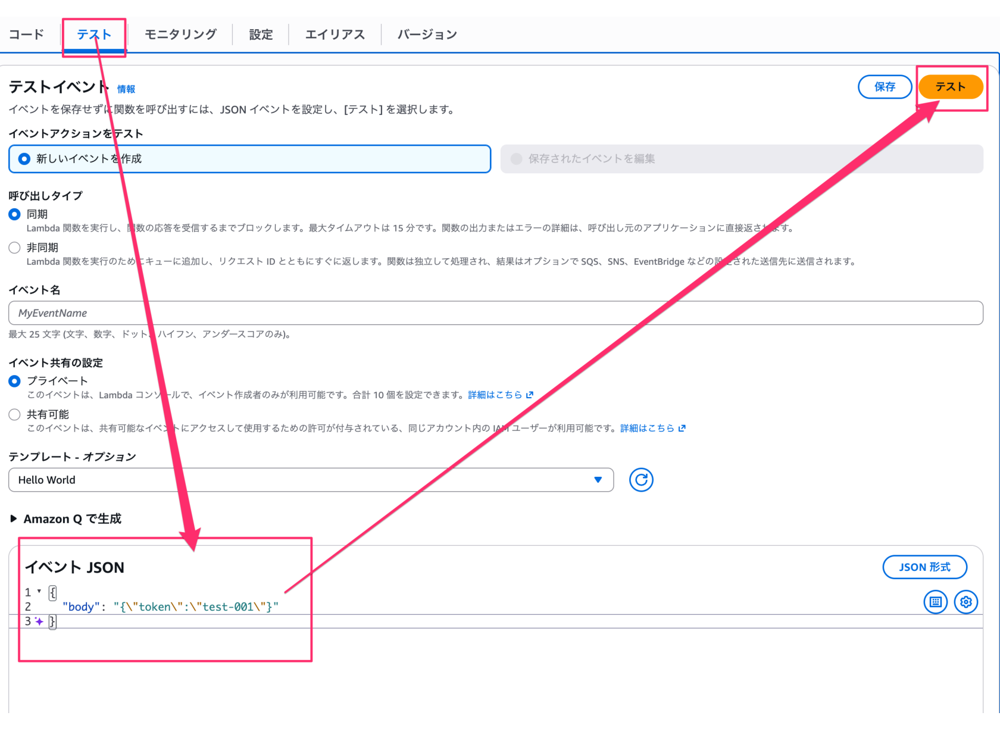

#### 2. Lambda の応答を確認する

1. 画面上部の「詳細」を開きます。
2. 「実行中の関数: 成功」と表示されていることを確認します。
3. `Response` の `statusCode` が `200` になっていることを確認します。
4. `body` に `access recorded`、`test-001`、実行日時が表示されていることを確認します。

応答の例は次のとおりです。

```json
{
  "statusCode": 200,
  "body": "{\"message\":\"access recorded\",\"token\":\"test-001\",\"accessedAt\":\"20XX-XX-XXTXX:XX:XX.XXXZ\"}"
}
```

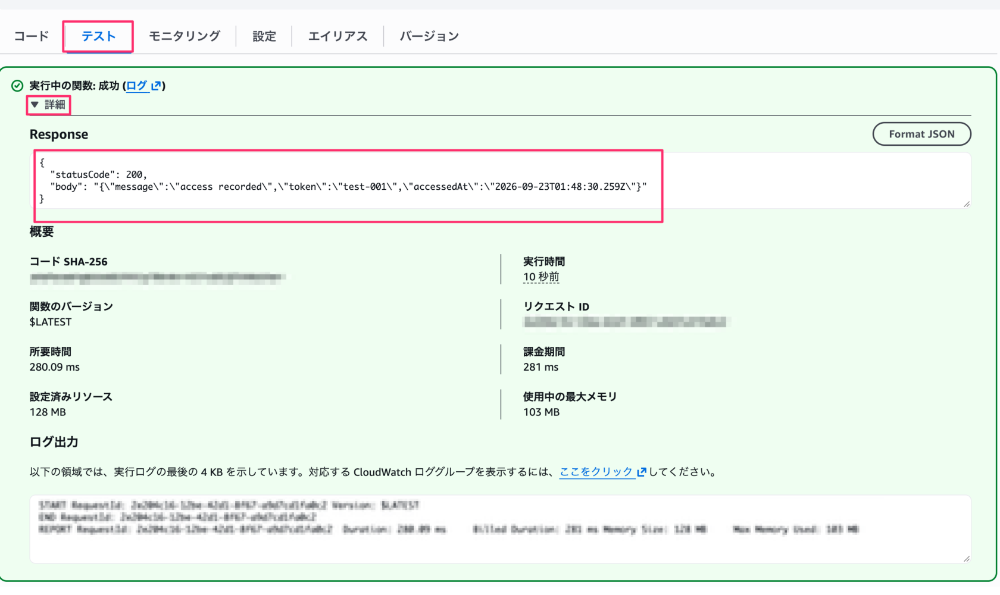

#### 3. DynamoDB のレコードを確認する

1. AWS 画面上部の検索欄に `DynamoDB` と入力し、検索結果の「DynamoDB」をクリックします。
2. 画面右上が、事前に決めた利用リージョンであることを確認します。
3. 左メニューの「項目を探索」をクリックします。
4. 「テーブル」から `training-accesses` を選びます。
5. 「スキャン」を選び、「実行する」をクリックします。
6. 結果一覧の `token` に `test-001` が表示されることを確認します。
7. `accessedAt` に Lambda を実行した日時が UTC の ISO 8601 形式で表示されることを確認します。

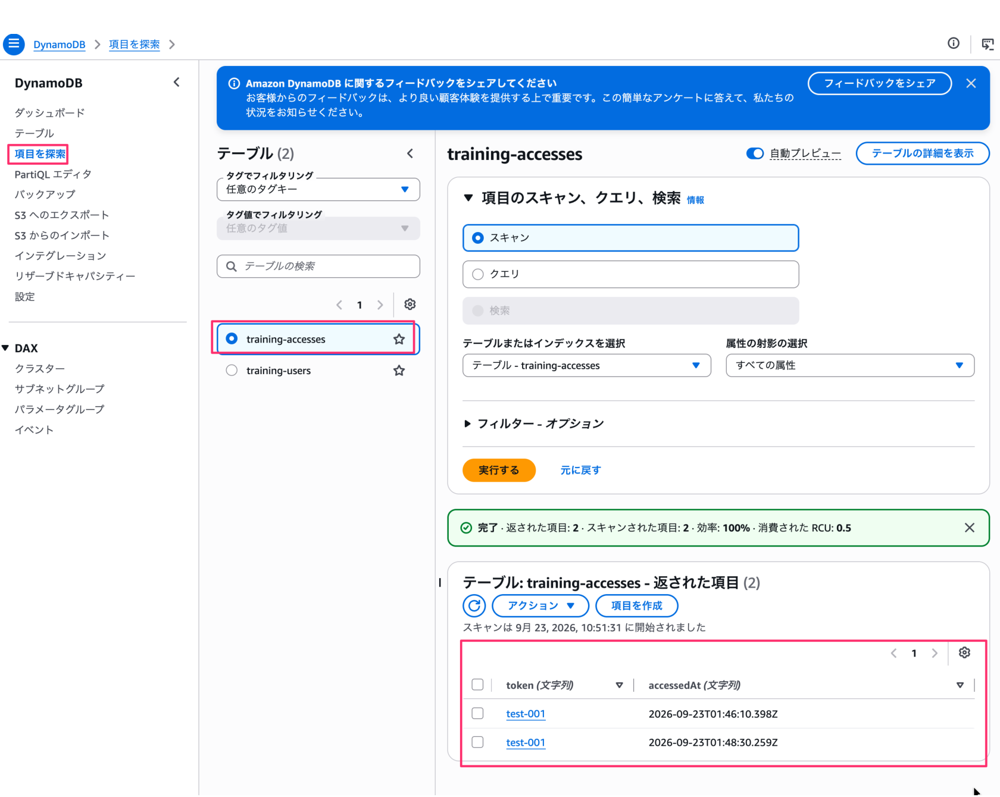

> [!NOTE]
> 🕒 テストを複数回実行すると、同じ `token` でも `accessedAt` が異なる項目として記録されます。

---

### 🔄 補足: 公開後に `index.html` を変更した場合

この操作は、手順2でアップロードした後に `index.html` を変更した場合だけ行います。変更していなければ必要ありません。

#### 1. S3 に上書きアップロードする

1. AWS 画面上部の検索欄に `S3` と入力し、検索結果の「S3」をクリックします。
2. 左メニューの「バケット」→「汎用バケット」の順にクリックします。
3. Web ページを保存しているバケット名をクリックします。
4. 「オブジェクト」タブの「アップロード」をクリックします。
5. 「ファイルを追加」から、更新した `index.html` を選びます。
6. 同名ファイルを上書きする内容になっていることを確認します。
7. 右下の「アップロード」をクリックします。
8. 緑色の成功メッセージが表示されたら完了です。

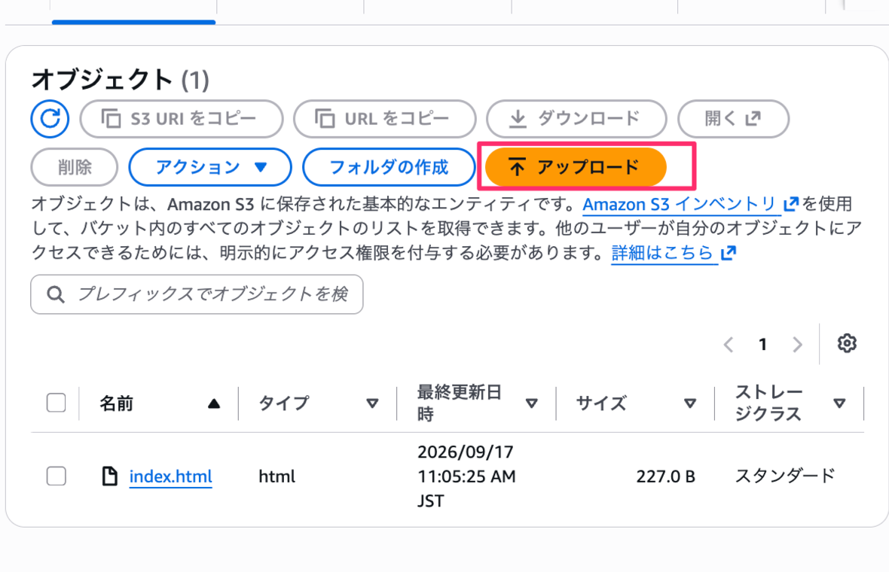

#### 2. CloudFront のキャッシュ削除を開く

1. AWS 画面上部の検索欄に `CloudFront` と入力し、検索結果の「CloudFront」をクリックします。
2. 左メニューの「ディストリビューション」をクリックします。
3. [手順3「CloudFront を作る」の「基本設定を入力する」](#cloudfront-distribution-name)で `Distribution name` に入力した名前を探し、クリックします。
4. 「キャッシュ削除」タブをクリックします。
5. 「キャッシュ削除を作成」をクリックします。

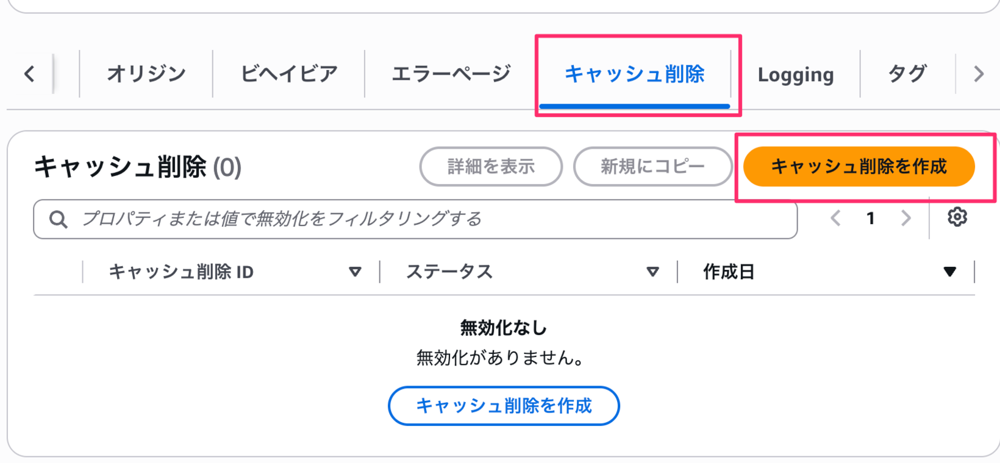

#### 3. すべてのファイルを無効にする

1. `Selection method` は `By paths` のままにします。
2. `Object paths to invalidate` に `/*` と入力します。
3. 「キャッシュ削除を作成」をクリックします。
4. キャッシュ削除のステータスが完了になるまで待ちます。

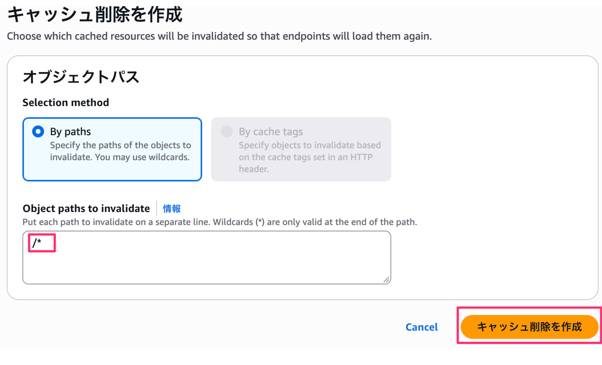

> [!NOTE]
> 💡 `/*` は、CloudFront に残っているすべてのパスのキャッシュを無効にする指定です。

---

<a id="check"></a>

## ✅ 最後の確認

- [ ] S3、DynamoDB、Lambda を事前に決めた同じ利用リージョンに作成した
- [ ] S3 の「パブリックアクセスをすべてブロック」が ON
- [ ] S3 バケットの中に `index.html` がある
- [ ] CloudFront の `S3 origin` に正しいバケットが表示されている
- [ ] `Allow private S3 bucket access to CloudFront` が ON
- [ ] `Default root object` が `index.html`
- [ ] CloudFront の URL で Web ページを開ける
- [ ] URL が `https://` で始まっている
- [ ] DynamoDB に `training-users` テーブルがあり、状態が「アクティブ」
- [ ] `training-users` のパーティションキーが `token`（文字列）
- [ ] `training-users` に `token: test-001` と `name: テスト太郎` の確認用項目がある
- [ ] DynamoDB に `training-accesses` テーブルがあり、状態が「アクティブ」
- [ ] `training-accesses` のキーが `token`（文字列）と `accessedAt`（文字列）
- [ ] `?token=test-001` を付けると `token = test-001` と表示される
- [ ] Lambda に `training-access-recorder` 関数がある
- [ ] 実行ロールに `TrainingAccessRecorderDynamoDBPolicy` がある
- [ ] `training-users` には `GetItem`、`training-accesses` には `PutItem` だけを許可している
- [ ] Lambda のコードを Deploy 済み
- [ ] `test-001` のテスト結果が `statusCode: 200`
- [ ] `training-accesses` に `test-001` と `accessedAt` が記録されている
- [ ] Web ページから Lambda を自動実行する接続は、この手順の対象外だと理解している

---

<a id="help"></a>

## 🆘 うまくいかないとき

| 画面に出るもの | 確認すること |
| --- | --- |
| `403` エラー | `Default root object` が `index.html` か確認。`S3 origin` と S3 のプライベートアクセスも確認 |
| `404` エラー | S3 バケットの中に `index.html` があるか確認 |
| 古いページが表示される | 数分待ってからブラウザーを再読み込み |
| S3 の URL を開けない | 正常な動き。CloudFront の URL を開く |
| DynamoDB のテーブルを作成できない | テーブル名とキー名を確認。DynamoDB を作成できる権限があるか管理者に確認 |
| DynamoDB の状態が「作成中」のまま | 少し待ってから、更新ボタンで画面を再読み込み |
| 作った DynamoDB テーブルや Lambda 関数が一覧にない | 画面右上が、作成時に選んだ利用リージョンか確認 |
| `token が指定されていません` と表示される | URL の末尾が `/?token=test-001` になっているか確認 |
| Lambda の「関数の作成」が押せない | Lambda 関数や実行ロールを作成できる権限があるか管理者に確認 |
| 実行ロールを開けない、またはポリシーを作成できない | IAM ロールとインラインポリシーを設定できる権限があるか管理者に確認 |
| IAM の JSON にエラーが表示される | JSON 全体を貼り直し、2つの ARN が二重引用符の内側にあるか、`<` と `>` が残っていないか確認 |
| `AccessDeniedException` | 実行ロールのインラインポリシー、操作名、2つのテーブル ARN を確認 |
| `ResourceNotFoundException` | Lambda と DynamoDB のリージョン、およびテーブル名を確認 |
| Lambda の応答が `400` | テスト JSON の `body` 内に `token` が入っているか確認 |
| Lambda の応答が `404` | `training-users` に `token: test-001` の項目があるか確認 |
| Lambda の応答が `500` | コードを Deploy 済みか確認し、テスト結果または CloudWatch Logs のエラーを確認 |
| テストは成功したが履歴が見つからない | `training-accesses` を選び直し、「スキャン」→「実行する」で再読み込み |
| 公開後に更新した `index.html` が表示されない | 補足手順の S3 上書きアップロードと CloudFront の `/*` のキャッシュ削除を確認 |

---

## 🔒 安全に使うために

- 訓練の許可を得た人だけが使用してください。
- パスワード、氏名、メールアドレスを入力させる画面は作らないでください。
- URL の `token` には、個人情報や認証情報を直接入れないでください。
- DynamoDB に実データを登録する場合は、保存目的、閲覧権限、保存期間を組織内で決めてください。
- DynamoDB の ARN や AWS アカウント ID を、公開リポジトリや外部のチャットへ貼らないでください。
- Lambda の実行ロールには必要なテーブルと操作だけを許可し、`Resource: "*"` は使わないでください。
- この手順では Lambda の関数 URL を有効にしません。外部公開する場合は、認証、入力検証、レート制限を別途設計してください。
- S3 のパブリックアクセスは、すべてブロックしてください。
- 訓練が終わったら、不要になった CloudFront、S3、DynamoDB のテーブル、Lambda 関数、IAM ポリシーを削除してください。
