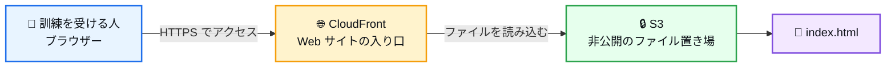
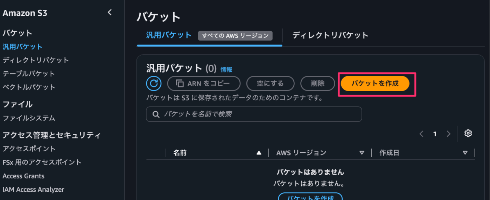
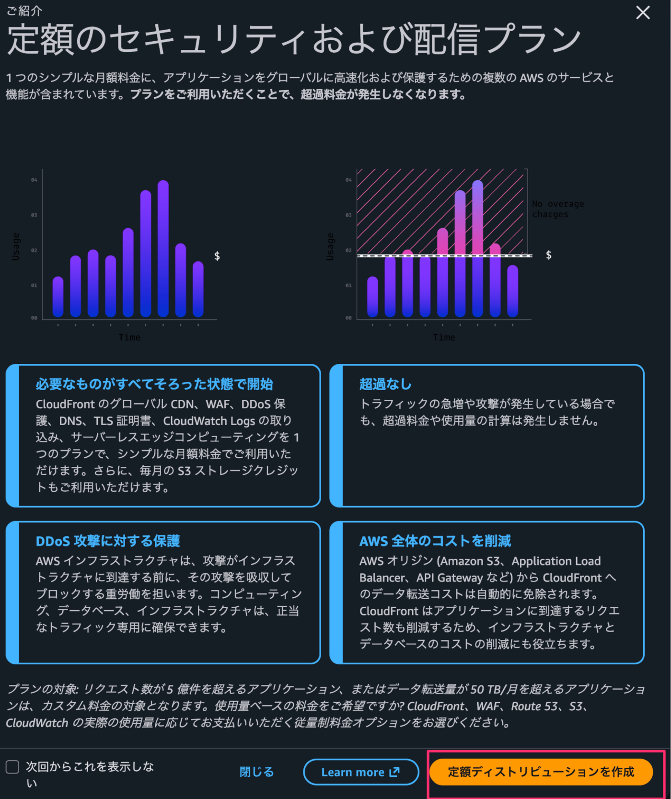
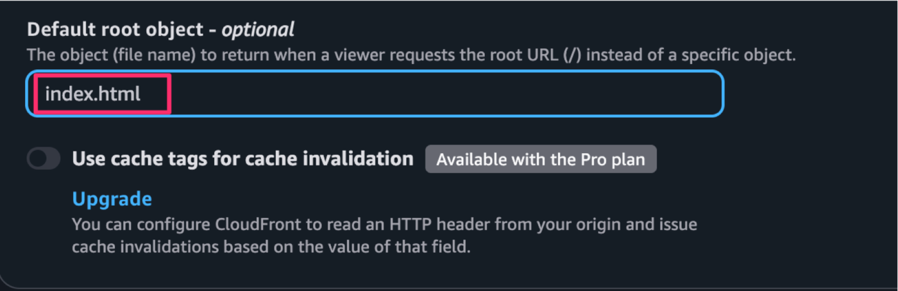

<div align="center">

<h1>🎯 phishing-simulation</h1>

<h3>AWS で作る、標的型攻撃メールの訓練用ページ</h3>

<p>📦 <strong>Amazon S3</strong> ・ 🌐 <strong>Amazon CloudFront</strong> ・ 📄 <strong>HTML</strong></p>

<p>AWS に詳しくない方でも作業できるように、<br>
押すボタンや入力内容を順番に説明します。</p>

</div>

---

> [!CAUTION]
> ⚠️ 必ず会社や組織の許可を得てから実施してください。パスワードや個人情報を入力させるページは作らないでください。

<p align="center">
  <a href="#overview">🗺️ しくみ</a> ・
  <a href="#words">📖 用語集</a> ・
  <a href="#steps">🚀 作り方</a> ・
  <a href="#check">✅ 最後の確認</a> ・
  <a href="#help">🆘 困ったとき</a>
</p>

<a id="overview"></a>

## 🗺️ 作るしくみ



- `S3` に Web ページのファイルを保存します。
- `CloudFront` を Web サイトの入り口にします。
- S3 は直接公開しません。CloudFront を通してページを表示します。

### 📍 作業の流れ

| 1️⃣ 保存場所を作る | 2️⃣ HTML を入れる | 3️⃣ Web 公開の入り口を作る | 4️⃣ トップページを決める | 5️⃣ 表示を確認する |
| :---: | :---: | :---: | :---: | :---: |
| 📦 S3 | 📄 `index.html` | 🌐 CloudFront | 🏠 Default root object | 🎉 完成 |

---

<a id="words"></a>

## 📖 よく出てくる言葉

| 言葉 | かんたんな意味 |
| --- | --- |
| S3 | ファイルを保存する場所 |
| バケット | S3 の中に作る、ファイル入れ |
| CloudFront | S3 のファイルを Web サイトとして表示するサービス |
| ディストリビューション | CloudFront で作る Web サイトの設定 |
| オリジン | CloudFront がファイルを取りに行く場所。この手順では S3 |
| デプロイ | 設定を AWS に反映すること |

---

## ✅ 作業を始める前に

次の3点を確認してください。

- AWS マネジメントコンソールにサインインできる
- S3 と CloudFront を作成できる権限がある
- 訓練の対象者、実施日、問い合わせ先が決まっている

> [!NOTE]
> 💡 AWS の画面は変更されることがあります。ボタンの場所が少し違っても、同じ名前の項目を探してください。

---

<a id="steps"></a>

## 🚀 作り方

### 1️⃣ S3 にバケットを作る

> **進み具合:** 🟩 ⬜ ⬜ ⬜ ⬜

#### 1. S3 の画面を開く

1. AWS マネジメントコンソールにサインインします。
2. 画面上部の検索欄に `S3` と入力します。
3. 検索結果の「S3」をクリックします。
4. 左メニューの「バケット」→「汎用バケット」の順にクリックします。
5. 「バケットを作成」をクリックします。



#### 2. バケットの設定を入力する

画面の項目を、上から順に設定します。

| 画面の項目 | 選ぶもの・入力するもの | 説明 |
| --- | --- | --- |
| AWS リージョン | 東京 `ap-northeast-1` | 東京になっていればそのまま |
| バケットタイプ | 汎用 | この手順で使うタイプ |
| バケット名前空間 | グローバル名前空間 | 変更しない |
| バケット名 | `<training-site-random-suffix>` | 自分で決めた名前に置き換える |
| オブジェクト所有者 | ACL 無効（推奨） | そのまま |
| パブリックアクセス | すべてブロックを ON | 必ず ON にする |
| バージョニング | 無効 | そのまま |
| タグ | なし | 追加しない |
| 暗号化 | SSE-S3 | そのまま |
| バケットキー | 初期設定のまま | 変更しない |
| 詳細設定 | 初期設定のまま | 変更しない |

> [!IMPORTANT]
> 🛠️ バケット名は、AWS 全体でほかの人と同じ名前を使えません。「この名前は使えません」と表示されたら、名前の後ろにランダムな英数字を追加してください。

#### 3. バケットを作る

1. 「パブリックアクセスをすべてブロック」が ON になっていることを、もう一度確認します。
2. 画面下部の「バケットを作成」をクリックします。
3. バケット一覧に、作ったバケットが表示されたら完了です。

---

### 2️⃣ `index.html` を S3 に入れる

> **進み具合:** 🟩 🟩 ⬜ ⬜ ⬜

#### 1. `index.html` を用意する

このプロジェクトフォルダーにある [`index.html`](./index.html) を使います。中身は次のとおりです。

```html
<!DOCTYPE html>
<html lang="ja">
<head>
  <meta charset="UTF-8">
  <title>Training Site</title>
</head>
<body>
  <h1>セキュリティ訓練ページ</h1>
  <p>このページは標的型訓練用です。</p>
</body>
</html>
```

> [!IMPORTANT]
> 📄 ファイル名は `index.html` です。`Index.html` や `index.htm` に変えないでください。

#### 2. S3 にアップロードする

1. S3 のバケット一覧を開きます。
2. 先ほど作ったバケット名をクリックします。
3. 「オブジェクト」タブの「アップロード」をクリックします。
4. 「ファイルを追加」をクリックします。
5. パソコンに保存されている `index.html` を選びます。
6. 画面に `index.html` が表示されたら、右下の「アップロード」をクリックします。
7. 緑色の成功メッセージが表示されたら完了です。
8. バケットの中に `index.html` が表示されていることを確認します。

> [!NOTE]
> 💡 この時点で S3 の URL を開けなくても正常です。次の手順で CloudFront を設定します。

---

### 3️⃣ CloudFront を作る

> **進み具合:** 🟩 🟩 🟩 ⬜ ⬜

#### 1. CloudFront の画面を開く

1. AWS 画面上部の検索欄に `CloudFront` と入力します。
2. 検索結果の「CloudFront」をクリックします。
3. 定額プランの案内が表示されたら、「定額ディストリビューションを作成」をクリックします。



4. 「Flat-rate plans」を選びます。
5. 無料プランの「Choose 無料」をクリックします。

> [!WARNING]
> 💰 画面に料金が表示されたら、作成する前に必ず確認してください。画面が画像と違う場合は、自分の画面に表示される案内に従ってください。

#### 2. 基本設定を入力する

「Get started」画面で設定します。

| 画面の項目 | 入力・選択するもの |
| --- | --- |
| Distribution name | 好きな名前。例: `<training-distribution>` |
| Description | 何も入力しない |
| Distribution type | Single website configuration |
| Route 53 managed domain | 何も入力しない |

入力できたら、「Next」をクリックします。

#### 3. S3 を選ぶ

「Specify origin」画面で設定します。

| 画面の項目 | 入力・選択するもの |
| --- | --- |
| Origin type | Amazon S3 |
| S3 origin | 「Browse S3」から、先ほど作ったバケットを選ぶ |
| Origin path | 何も入力しない |
| Allow private S3 bucket access to CloudFront | ON のまま |
| Origin settings | Use recommended origin settings |
| Cache settings | Use recommended cache settings tailored to serving S3 content |

S3 バケットの選び方は次のとおりです。

1. `S3 origin` の「Browse S3」をクリックします。
2. 先ほど作ったバケットを選びます。
3. 「Choose」をクリックします。
4. `S3 origin` に選んだバケットが表示されたことを確認します。
5. 「Next」をクリックします。

> [!IMPORTANT]
> 🔒 `Allow private S3 bucket access to CloudFront` は ON のままにしてください。S3 を直接公開せず、CloudFront からだけファイルを読めるようにするためです。

#### 4. セキュリティ画面を確認する

1. 「Enable security」画面が表示されます。
2. 有料機能の表示がある場合は、料金を確認します。
3. この手順では設定を変えず、「Next」をクリックします。

#### 5. CloudFront を作成する

1. 「Review and create」画面で、これまでの設定が表示されます。
2. `S3 origin` に正しいバケットが表示されていることを確認します。
3. 画面右下の「Create distribution」をクリックします。
4. 緑色の「新しいディストリビューションが正常に作成されました。」が表示されることを確認します。
5. 「最終変更日」が「デプロイ」になるまで待ちます。

> [!NOTE]
> ⏳ 設定の反映には時間がかかることがあります。すぐに完了しない場合は、少し待ってから画面を再読み込みしてください。

---

### 4️⃣ トップページに `index.html` を設定する

> **進み具合:** 🟩 🟩 🟩 🟩 ⬜

1. 作成した CloudFront ディストリビューションの詳細画面を開きます。
2. 「一般」タブをクリックします。
3. 「設定」の右上にある「編集」をクリックします。
4. `Default root object - optional` に `index.html` と入力します。



> [!IMPORTANT]
> ✍️ `index.html` の前に `/` は付けません。`/index.html` ではなく、`index.html` と入力してください。

5. 画面下部の「変更を保存」をクリックします。
6. 緑色の「ディストリビューション設定が正常に更新されました。」が表示されることを確認します。
7. 設定の反映が終わるまで待ちます。

---

### 5️⃣ Web ページを開く

> **進み具合:** 🟩 🟩 🟩 🟩 🟩

1. CloudFront の「一般」タブを開きます。
2. 「ディストリビューションドメイン名」を探します。
3. 表示されたドメイン名をコピーします。
4. ブラウザーのアドレス欄に、次のように入力します。

```text
https://<コピーしたドメイン名>/
```

5. 「セキュリティ訓練ページ」と表示されたら成功です。🎉

---

<a id="check"></a>

## ✅ 最後の確認

- [ ] S3 の「パブリックアクセスをすべてブロック」が ON
- [ ] S3 バケットの中に `index.html` がある
- [ ] CloudFront の `S3 origin` に正しいバケットが表示されている
- [ ] `Allow private S3 bucket access to CloudFront` が ON
- [ ] `Default root object` が `index.html`
- [ ] CloudFront の URL で Web ページを開ける
- [ ] URL が `https://` で始まっている

---

<a id="help"></a>

## 🆘 うまくいかないとき

| 画面に出るもの | 確認すること |
| --- | --- |
| `403` エラー | `Default root object` が `index.html` か確認。`S3 origin` と S3 のプライベートアクセスも確認 |
| `404` エラー | S3 バケットの中に `index.html` があるか確認 |
| 古いページが表示される | 数分待ってからブラウザーを再読み込み |
| S3 の URL を開けない | 正常な動き。CloudFront の URL を開く |

---

## 🔒 安全に使うために

- 訓練の許可を得た人だけが使用してください。
- パスワード、氏名、メールアドレスを入力させる画面は作らないでください。
- S3 のパブリックアクセスは、すべてブロックしてください。
- 訓練が終わったら、不要になった CloudFront と S3 を削除してください。
